:toc: left
= Test Lab Guide: Fedora 35

== Abstract 

This Test Lab Guide (TLG) will provide the user with step-by-step instructions on how to configure a basic network configuration using Fedora 35 servers and a Fedora 35 client. The resulting test lab environment will provide a stable base for building other test labs. It is recommended that users preserve the start of their test machines once this walk-through has been successfully completed. In a physical environment the hard drive of the machine can be imaged. In a virtual environment, the “snapshot” or equivalent feature can be used to preserve the current state of the operating system. Preserving the working conditions of the basic test lab will allow the user to experiment without fear of having to completely rebuild their environment. The ultimate goal of the TLG is to familiarize the user with the Fedora 35 Operating system and how to deploy common network services based on that operating system, and ultimately enable the user to conduct their own experiments in a Fedora 35 based environment.

== Introduction 

The purpose of the Test Lab Guides (TLGs) is providing users with practical guidelines for deploying current operating systems in a way that results in a functional configuration. Using a TLG will instruct the user in which servers to create, how to configure the operating systems and services, and how to install and configure additional software. A TLG experience enables the user to experience the entire set-up process from start to finish.  
 
This TLG is written with the goals of reusability and extensibility in mind. The purpose of this particular TLG is to enable the creation of a basic network utilizing Fedora 35 as the central operating system. Once this network is complete several other TLGs can be built on top of this base configuration.  
 
Once this lab is completed, it would be wise to save the initial configuration. How this is best done will depend on how the test environment was originally deployed. A physical environment can be preserved by imaging the drives of each machine to be stored in a separate location and retrieved when needed. In a network deployed virtually, a snapshot can be taken of each machine. This will preserve the current settings and configurations. Preserving the lab in a functional state is important, because it allows for a functional configuration to be restored without completely repeating the base lab configuration steps. This is helpful for correcting after a mistake or generating a test environment for a new product.

****
Note: If you are completing these TLG’s in a virtual environment using VMWare and have access to an electronic copy of this document, and you have VMWare Tools installed on the Virtual Machine, utilize the ability to copy and paste text from the host machine to the VM.  Copying and pasting will help to reduce typos and command errors.

* Highlight and right-click a command from this document
* Click Copy
* Right-click in the virtual machine where you would like to copy the text to and click Paste
* If you are working inside a terminal, you may only need to right click in order to copy the command over
****

== Disclaimer

This website contains work created for informational purposes.
Information may be out of date, or changed or updated without notice. By
using this website, you recognize and agree that all information is provided
“AS IS” without warranty of any kind, either express or implied, including,
but not limited to, the implied warranties of merchantability, fitness for a
particular purpose, or non-infringement.

The entire risk arising out of the use of these guides remains with you. IN
NO EVENT SHALL CHAMPLAIN COLLEGE, ITS STUDENTS, FACULTY,
OR ANYONE ELSE INVOLVED IN THE CREATION, PRODUCTION,
OR DELIVERY OF THE GUIDES BE LIABLE TO ANY PERSON FOR
ANY DIRECT, INDIRECT, SPECIAL, OR OTHER CONSEQUENTIAL
DAMAGES FOR ANY USE OF THE MATERIAL ON THIS WEBSITE. This
includes, without limitation, damages for lost profits, business interruption, loss of data or business information, damage to computer equipment or networks, or other loss arising out of the use of any information in the guides.

== Contents of This Guide 

This document contains instructions for setting up the Fedora 35 configuration test lab by deploying two servers running Fedora, one client running Fedora with a desktop environment, and one firewall built on Fedora. Once completed, the lab will simulate the functioning of a private intranet.  

*Important*: The instructions provided in this document are for educational purposes. They do not represent best practices nor are they recommendations for a production network. These configurations should not be put into place on a production network. This network should be deployed on a separate network specific to testing (physical or virtual). 

=== Network Overview 

The Fedora 35 base configuration test lab consists of the following: 

** One server running Fedora 35 named fw1
*** IP Address: 192.168.200.1
*** Gateway: N/A
*** DNS Server: 192.168.200.10
*** Hostname: fw1.college.com
*** Two NICs configured to handle traffic between the intranet and the external internet connection 

** One server running Fedora 35 named dc1
*** IP Address: 192.168.200.10
*** Gateway: 192.168.200.1
*** DNS Server: 192.168.200.10 (localhost)
*** Hostname: dc1.college.com
*** Configured as the intranet Domain Name System (DNS), and Dynamic Host Configuration Protocol (DHCP) server 

** One server running Fedora 35 named app1
*** IP Address: 192.168.200.20
*** Gateway: 192.168.200.1
*** DNS Server: 192.168.200.10
*** Hostname: app1.college.com
*** Configured on the intranet as a system logging server 

** One client running Fedora 35 named client1 
*** IP Address: 192.168.200.30
*** Gateway: 192.168.200.1
*** DNS Server: 192.168.200.10
*** Hostname: client1.college.com
*** Will have ability to switch between the intranet and internet subnets 

The Fedora 35 base configuration TLG is comprised of one subnet: 

** An intranet, known as the internal subnet (192.168.200.0/24 in this example) 

Network Diagram:

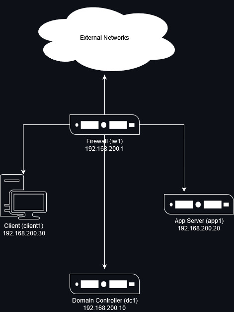

This document consists of four major parts as follows: 

** Step One - Configure Firewall

** Step Two - Configure Domain Controller

** Step Three - Configure Client

** Step Four - Configure App Server

=== Hardware and Software Requirements 

The following are the minimum required components for deploying the test lab:  

** An installer disc or .iso file for Fedora 35, 64 bit

** One machine that will meet the minimum install requirements for Fedora with 2 NICs 

** Three machines that will meet the minimum install requirements for Fedora  
 
=== Using “Sudo”

When running many commands throughout these TLGs you may be required to use ‘sudo’ depending on the level of privilege the current user has.  The ‘sudo’ command allows the command following it to be run at superuser privileges.  It is important to note that the user must be in the ‘sudoers’ file in order to successfully use this command. If you make the account an administrator while installing, it will be added to the ‘sudoers’ file automatically. Once a command is preceded by ‘sudo’ the user will be prompted for the password for the account and then the command can be run at superuser privilege.

== Configuring the Environment
=== **Step One** - Configure Firewall 

The following instructions will detail the installation and configuration of the Firewall system. It will consist of 4 notable sections as follows: 

1. Installing the Operating System
2. Configure TCP/IP Properties
3. Configure NAT Rules
4. Snapshot Configuration

=== Install the Operating System on Firewall

. Configure your physical machine or VM to the system specifications you desire
.. At least two cores and two gigabytes of RAM is reccomended for Fedora 35 machines
.. Ensure an additional network adapter (NIC) is added to the Firewall machine
. Start the Firewall machine with the .iso or disk installer inserted
.. Use the arrow keys to navigate the installation media, press enter to confirm a selection
.. A mouse can also be used to navigate the GUI installation media
. Select the language relevant to you and then select `Continue`
. On the Installation Summary screen, several parameters will auto-populate. You may change them here
. Under the `System` column, select `Installation Destination`
.. Ensure that the disk Fedora is intended to be installed on has a black checkmark in the lower right corner
.. Select `Done` in the upper left corner to finalize the installation destination
. Several other optional menus are avalible like `Software Selection` or `Time & Date`, however the default values are acceptable for this use case
. Under the `User Settings` column, select `Root Account`
.. Choose whether or not to enable the root account, for this use case we will enable the root account by selecting `Enable root account`
.. Choose an appropriate root password for your installation
.. Select `Done` in the upper left corner to finalize the root password creation
. Under the `User Settings` column, select `User Creation`
.. Create a new user for Firewall
... In this case the user will be: `champuser`
... And the password will be: `Ch@mpl@1n!22`
... Check the box `Make this user administrator`
.. Select `Done` in the upper left corner to finalize the user creation.
. For all additional items, select the default values and continue with `Begin Installation`
. Upon completion of the installation, select `Reboot System`

=== Configure TCP/IP Properties

. Make note of the names of your network interfaces
.. Run the command `ifconfig -a` to display them
. Set the hostname of the Firewall machine using the command `sudo hostnamectl set-hostname fw1.college.com`
.. You must logout and login again for this change to be apparent
. The external interface should be automatically configured as a DHCP briged connection and can be left alone
. The internal interface will need to be configured with a static IP using `nmcli`
. Assign the internal interface an IP address with the command `nmcli connection modify ens192 ipv4.addresses 192.168.200.1/24`
.. You may have a different internal network interface than shown, subsitiute that for `ens192` within the command above
. Assign the internal interface a gateway with the command `nmcli connection modify ens192 ipv4.gateway 192.168.200.1`
. Assign the internal interface a dns server with the command `nmcli connection modify ens192 ipv4.dns 192.168.200.10`
. Assign the internal interface a DNS search base with the command `nmcli connection modify ens192 ipv4.dns-search college.com`
. Change the networking method to manual for ipv4 connections using the command `nmcli connection modify ens192 ipv4.method manual`
. Restart internal network interface to apply changes using the command `nmcli connection down ens192; nmcli connection up ens192`
. Using the command `nmcli device show ens192` you changes should look similar to the image below:
+
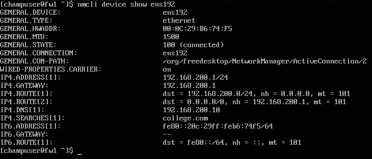

=== Configure NAT Rules

. Use nano or vim to edit the local sysctl.conf file to setup IPv4 forwarding
.. `sudo nano /etc/sysctl.conf`
. Find and uncomment - or add - the line `net.ipv4.ip_forward=1`
.. Save and exit the modified sysctl file
. Enter the command `sudo sysctl -p` to implement your changes
. Disable and mask firewalld, then install and enable `iptables-service` with the following commands:
+
```
sudo systemctl disable firewalld --now
sudo systemctl mask firewalld
sudo yum install iptables-services -y
sudo systemctl enable iptables --now
```
. Elevate to root to apply iptables configuration changes using the command `sudo -i`
. Apply the following NAT and IP masquerading rules:
+
```
iptables -t nat -A POSTROUTING -o eth0 -j MASQUERADE
iptables -I FORWARD 1 -i eth0 -o eth1 -m state --state RELATED,ESTABLISHED -j ACCEPT
iptables -I FORWARD 2 -i eth1 -o eth0 -j ACCEPT
```
. Apply iptables rules with the command `iptables-save > /etc/sysconfig/iptables`

=== Snapshot the Configuration 

Preserving a functional state of the machine is important in case changes are made accidently. This can be done using VMWare’s snapshot functionality or other software packages for hardware labs.

=== **Step Two** - Configure Domain Controller 

The following instructions will detail the installation and configuration of the Domain Controller system. It will consist of 6 notable sections as follows: 

1. Installing the Operating System
2. Configure TCP/IP Properties
3. Configure DNS
4. Configure DHCP
5. Reconfigure TCP/IP Properties
6. Rnapshot Configuration

=== Install the Operating System on Domain Controller

. Configure your physical machine or VM to the system specifications you desire
.. At least two cores and two gigabytes of RAM is reccomended for Fedora 35 machines
. Start the Domain Controller machine with the .iso or disk installer inserted
.. Use the arrow keys to navigate the installation media, press enter to confirm a selection
.. A mouse can also be used to navigate the GUI installation media
. Select the language relevant to you and then select `Continue`
. On the Installation Summary screen, several parameters will auto-populate. You may change them here
. Under the `System` column, select `Installation Destination`
.. Ensure that the disk Fedora is intended to be installed on has a black checkmark in the lower right corner
.. Select `Done` in the upper left corner to finalize the installation destination
. Several other optional menus are avalible like `Software Selection` or `Time & Date`, however the default values are acceptable for this use case
. Under the `User Settings` column, select `Root Account`
.. Choose whether or not to enable the root account, for this use case we will enable the root account by selecting `Enable root account`
.. Choose an appropriate root password for your installation
.. Select `Done` in the upper left corner to finalize the root password creation
. Under the `User Settings` column, select `User Creation`
.. Create a new user for Domain Controller
... In this case the user will be: `champuser`
... And the password will be: `Ch@mpl@1n!22`
... Check the box `Make this user administrator`
.. Select `Done` in the upper left corner to finalize the user creation.
. For all additional items, select the default values and continue with `Begin Installation`
. Upon completion of the installation, select `Reboot System`

=== Configure TCP/IP Properties

. Make note of the names of your network interfaces
.. Run the command `ifconfig -a` to display them
. Set the hostname of the Domain Controller machine using the command `sudo hostnamectl set-hostname dc1.college.com`
.. You must logout and login again for this change to be apparent
. The network interface will need to be configured with a static IP using `nmcli`
. Assign the network interface an IP address with the command `nmcli connection modify ens160 ipv4.addresses 192.168.200.10/24`
.. You may have a different network interface than shown, subsitiute that for `ens160` within the command above
. Assign the network interface a gateway with the command `nmcli connection modify ens160 ipv4.gateway 192.168.200.1`
. Assign the network interface a dns server with the command `nmcli connection modify ens160 ipv4.dns 192.168.200.1`
. Change the networking method to manual for ipv4 connections using the command `nmcli connection modify ens160 ipv4.method manual`
. Restart network interface to apply changes using the command `nmcli connection down ens160; nmcli connection up ens160`
. Using the command `nmcli device show ens160` you changes should look similar to the image below:
+
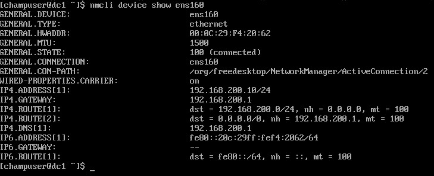

=== Configure DNS

. Install required packages for DNS functionality with the command `sudo yum install bind* -y`
. Use nano or vim to edit the `named.conf` file
.. `sudo nano /etc/named.conf`
. Edit the `listen-on`, `allow-query`, and `forwarders` lines in the `options` sections
.. Your configurations should look similar to the image below:
+
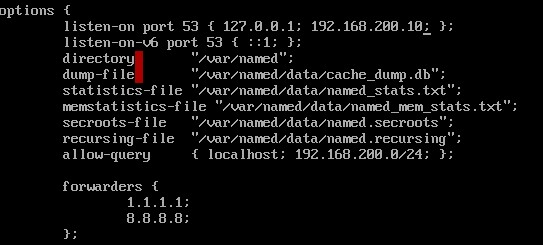
. At the bottom of the file, add sections for forward and reverse lookup zones so that they look similar to the image below:
+
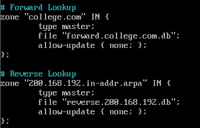
. Save and exit the modified `named.conf` file
.. If using nano press CTRL + x and then y to save end exit
.. If using vim press ESC then type :wq to save and exit
. Create a forward lookup file at the location specified in the `named.conf` file
.. This can be done from scratch or by using the command `sudo cp /var/named/named.empty /var/named/forward.college.com.db`
. Use nano or vim to edit the `forward.collcge.com.db` configuration file
.. Edit the configuration file so that it looks similar to the image below:
+
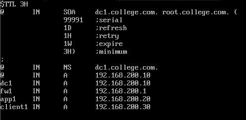

. Create a reverse lookup file at the location specified in the `named.conf` file
.. This can be done from scratch or by using the command `sudo cp /var/named/forward.college.com /var/named/reverse.200.168.192.db`
. Use nano or vim to edit the `reverse.200.168.192.db` configuration file
.. Edit the configuration file so that it looks similar to the image below:
+
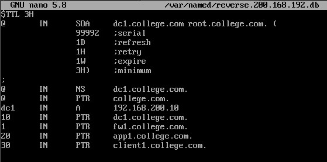
. To verify the successful configuration of the forward and reverse lookup files run the following commands. They should return `OK`
+
```
named-checkzone college.com /var/named/forward.college.com
named-checkzone 200.168.192.in-addr.arpa /var/named/reverse.college.com
```
. If there are no errors, enable bind to start on boot using the command `systemctl enable --now named`
. Add the DNS service as an exception in the device firewall using the following commands:
+
```
sudo firewall-cmd --add-service=dns --permanent
sudo firewall-cmd --reload
```
. Test final DNS functionality with `nslookup` or `dig` like shown in the image below:
.. Note: This must be done after reconfiguring TCP/IP properties below
+
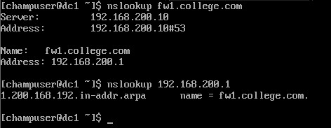

=== Configure DHCP

. Install required packages for DHCP functionality with the command `sudo yum install dhcp-server -y`
. Use nano or vim to edit the `dhcpd.conf` file
.. `sudo nano /etc/dhcp/dhcpd.conf`
. Your configurations should look similar to the image below:
+
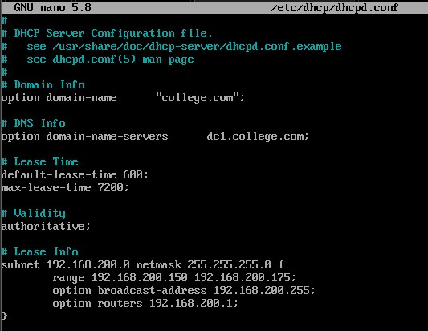
. Enable DHCP service on startup with the command `sudo systemctl enable dhcpd`
. Add the DHCP service as an exception in the device firewall using the following commands:
+
```
sudo firewall-cmd --add-service=dhcp --permanent
sudo firewall-cmd --reload
```

=== Reconfigure TCP/IP Properties

. Reassign the internal interface a dns server with the command `nmcli connection modify ens160 ipv4.dns 192.168.200.10`
. Assign the internal interface a DNS search base with the command `nmcli connection modify ens160 ipv4.dns-search college.com`
. Restart network interface to apply changes using the command `nmcli connection down ens160; nmcli connection up ens160`

=== Snapshot the Configuration 

Preserving a functional state of the machine is important in case changes are made accidently. This can be done using VMWare’s snapshot functionality or other software packages for hardware labs.

=== **Step Three** - Configure Client 

The following instructions will detail the installation and configuration of the Client system. It will consist of 3 notable sections as follows: 

1. Installing the Operating System on Client
2. Configure TCP/IP Properties
3. Snapshot Configuration

=== Install the Operating System

. Configure your physical machine or VM to the system specifications you desire
.. At least two cores and two gigabytes of RAM is reccomended for Fedora 35 machines
.. More RAM may be required to run a GUI installation
. Start the Client machine with the .iso or disk installer inserted
.. Use the arrow keys to navigate the installation media, press enter to confirm a selection
.. A mouse can also be used to navigate the GUI installation media
. On the Welcome to Fedora screen, select `Install to Hard Drive`
.. It may take multiple minutes for the Fedora 35 installation screen to pop up
. Select the language relevant to you and then select `Continue`
. On the Installation Summary screen, several parameters will auto-populate. You may change them here
. Under the `System` column, select `Installation Destination`
.. Ensure that the disk Fedora is intended to be installed on has a black checkmark in the lower right corner
.. Select `Done` in the upper left corner to finalize the installation destination
. Under the `Localization` column, select `Time & Date` and ensure it is configured relevant to you
. For all additional items, select the default values and continue with `Begin Installation`
. Upon completion of the installation, select `Finish Installation`
. To ensure full functionality reboot the system now by navigating to the power icon in the top right, selecting `Power Off/Log Out`, and selecting `Restart`

=== Configure TCP/IP Properties

. At this point the DHCP server, dc1, should automatically populate the Client device with an IP address
. Test connectivity and DNS server function by navigating to Firefox on the bottom taskbar and browsing to a website
.. Alternatively, you can open a terminal window by searching for it in the app list and entering the command `ping google.com -c 4`
. Because we already established static A records for it, client1 will get a static IP too
. To set a static IP on a Fedora 35 workstation machine, first navigate to the top right of the GUI window and select the drop down menu from the power icon
. Select `Wired Off/Connected`, then select `Wired Settings`, then select the gear wheel in the Wired section of the new window that has opened
. In the Wired window select IPv4
. Change the IPv4 Method to Manual
.. Change the following fields so that it looks similar to the image below:
+
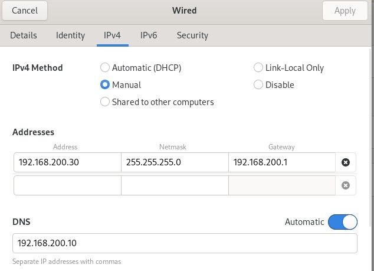

. Select Apply to save the configuration
. In the Wired Settings window, ensure you turn the network to its connected state with the on/off slider
.. To test connectivity to the external network, open a terminal window and use the command `ping google.com -c 4`

=== Snapshot the Configuration 

Preserving a functional state of the machine is important in case changes are made accidently. This can be done using VMWare’s snapshot functionality or other software packages for hardware labs.

=== **Step Four** - Configure App Server

The following instructions will detail the installation and configuration of the App Server system. It will consist of 4 notable sections as follows: 

1. Installing the Operating System on App Server
2. Configure TCP/IP Properties
3. Configure Apache
4. Snapshot Configuration

=== Install the Operating System

. Configure your physical machine or VM to the system specifications you desire
.. At least two cores and two gigabytes of RAM is reccomended for Fedora 35 machines
. Start the App Server machine with the .iso or disk installer inserted
.. Use the arrow keys to navigate the installation media, press enter to confirm a selection
.. A mouse can also be used to navigate the GUI installation media
. Select the language relevant to you and then select `Continue`
. On the Installation Summary screen, several parameters will auto-populate. You may change them here
. Under the `System` column, select `Installation Destination`
.. Ensure that the disk Fedora is intended to be installed on has a black checkmark in the lower right corner
.. Select `Done` in the upper left corner to finalize the installation destination
. Several other optional menus are avalible like `Software Selection` or `Time & Date`, however the default values are acceptable for this use case
. Under the `User Settings` column, select `Root Account`
.. Choose whether or not to enable the root account, for this use case we will enable the root account by selecting `Enable root account`
.. Choose an appropriate root password for your installation
.. Select `Done` in the upper left corner to finalize the root password creation
. Under the `User Settings` column, select `User Creation`
.. Create a new user for App Server
... In this case the user will be: `champuser`
... And the password will be: `Ch@mpl@1n!22`
... Check the box `Make this user administrator`
.. Select `Done` in the upper left corner to finalize the user creation.
. For all additional items, select the default values and continue with `Begin Installation`
. Upon completion of the installation, select `Reboot System`

=== Configure TCP/IP Properties

. Make note of the names of your network interfaces
.. Run the command `ifconfig -a` to display them
. Set the hostname of the App Server machine using the command `sudo hostnamectl set-hostname app1.college.com`
.. You must logout and login again for this change to be apparent
. The network interface will need to be configured with a static IP using `nmcli`
. Assign the network interface an IP address with the command `nmcli connection modify ens160 ipv4.addresses 192.168.200.20/24`
.. You may have a different network interface than shown, subsitiute that for `ens160` within the command above
. Assign the network interface a gateway with the command `nmcli connection modify ens160 ipv4.gateway 192.168.200.1`
. Assign the network interface a dns server with the command `nmcli connection modify ens160 ipv4.dns 192.168.200.10`
. Assign the network interface a DNS search base with the command `nmcli connection modify ens160 ipv4.dns-search college.com`
. Change the networking method to manual for ipv4 connections using the command `nmcli connection modify ens160 ipv4.method manual`
. Restart internal network interface to apply changes using the command `nmcli connection down ens160; nmcli connection up ens160`
. Using the command `nmcli device show ens160` you changes should look similar to the image below:
+
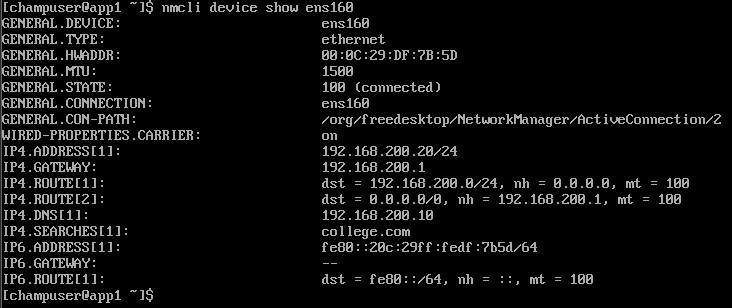

=== Configuring Apache

. Install required packages for Apache functionality with the command `sudo yum install httpd -y`
. Enable the Apache service on startup with the command `sudo systemctl enable httpd`
. Add the http and https services as an exception in the device firewall using the following commands:
+
```
sudo firewall-cmd --add-service=http --permanent
sudo firewall-cmd --add-service=https --permanent
sudo firewall-cmd --reload
```
. Turn the Apache service on with the command `sudo systemctl start httpd`
. Optionally, you can add an `index.html` or any other html document to the `/var/www/html/` directory to customize your webserver
. On client1 using a GUI web brower, you can navigate to the host name of app1 to access the sample webpage as seen in the image below:
.. `http://app1.college.com/`
+
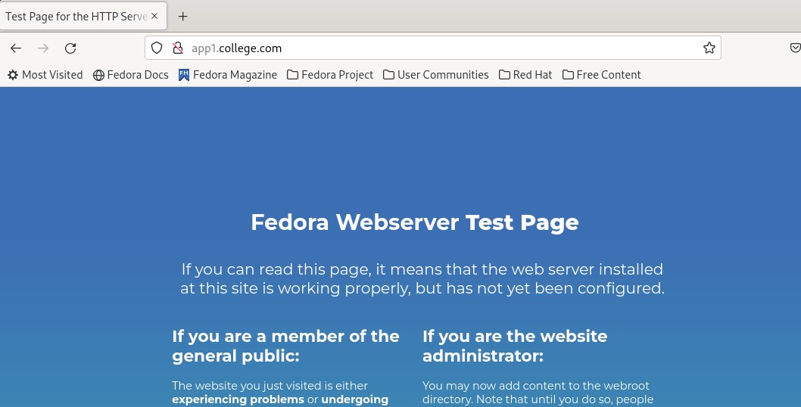

== Snapshot the Configuration 

Preserving a functional state of the machine is important in case changes are made accidently. This can be done using VMWare’s snapshot functionality or other software packages for hardware labs.

== Security Services

* [Wazuh - Coming Soon]

== Troubleshooting

* Nano is the prefered text editor by many, however it does not come installed on Fedora 35. To install use the command `sudo yum install nano -y`
* To test firewall functionality client1 could be setup as step two, although the user would be required to setup a static IP within the GUI, as DHCP services would not be configured at that point.
* If you find that a change you made is not being implememnted, make sure you restart services after reconfiguring things with `systemctl restart [service]`
* You can find general logs in the `/var/log/...` directories, and systemctl will instruct you on how to determine error codes when you run `systemctl status [service]`
* Upon receiving connecting issues, always test the service by first pinging the default gateway of your router, and then a public dns service like `8.8.8.8` or `1.1.1.1` if that is successful.
* If you are having trouble with Bind or other DNS configuraions, check your syntax. Many configuration files are strict with use of semicolons `;` and periods `.`.

== Contributors
* Ethan Allis
