:toc: left
= Test Lab Guide: Fedora 35 - Wazuh Manager & Agents

== Introduction

This document is designed to be used in tandem with the Unix Test Lab Guide (TLG) for Fedora 35. It contains instructions on how to install, configure, and test the Wazuh Server and accompanying Agents. This guide will provide the user a step-by-step guide, upon completion of which will allow them to build their skills for use in future labs or activities. All configuration steps should be done on the Application Server system unless otherwise noted.


== Open Necessary Ports

. Before proceeding to the main part of the installation process, it is necessary to open the ports the following software will use using the following commands
.. This includes ports: 5601/tcp, 1514/udp & tcp, 1515/udp & tcp
+
```
firewall-cmd --add-port=5601/tcp --permanent
firewall-cmd --add-port=1514/udp --permanent
firewall-cmd --add-port=1515/udp --permanent
firewall-cmd --add-port=1514/tcp --permanent
firewall-cmd --add-port=1515/tcp --permanent
firewall-cmd --reload
```

== Installation of Wazuh Manager

. To begin, elevate to root with `sudo -i`, and then establish the Wazuh repository with the following command:
+
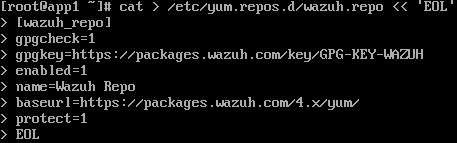

. Then import the GPG key using the command `rpm --import https://packages.wazuh.com/key/GPG-KEY-WAZUH`
. Using dnf, install the Wazuh Manager using the command `sudo dnf -y install wazuh-manager` 
. Start Wazuh manager with the command `sudo systemctl start wazuh-manager`
. Enable Wazuh Manager on startup with the command `sudo systemctl senable wazuh-manager`
. Disable repo updates for stability with the command `sudo sed -i "s/enabled=1/enabled=0/" /etc/yum.repos.d/wazuh.repo`

== Dependancy Installation
=== Elasticsearch
Elasticsearch is a distributed, RESTful search and analytics engine capable of addressing a growing number of use cases. As the heart of the Elastic Stack, it centrally stores data for fast search, fine‑tuned relevancy, and powerful analytics that scale with ease. Elasticsearch is commonly used for log analytics, full-text search, security intelligence, business analytics, and operational intelligence use cases.

. Elevate to root with `sudo -i`, and then establish the Elasticsearch repository with the following command:
+
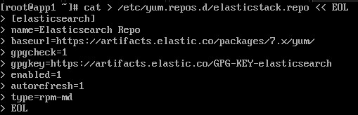

. Install Elasticsearch with the following command `sudo dnf install elasticsearch-7.11.2`
. Start Elasticsearch with `sudo systemctl daemon-reload`
. Enable Elasticsearch with `sudo systemctl enable --now elasticsearch`

=== Filebeat
Filebeat is a lightweight shipper for forwarding and centralizing log data. Installed as an agent on your servers, Filebeat monitors the log files or locations that you specify, collects log events, and forwards them to Elasticsearch for indexing.

. Install Filebeat with the following command `sudo dnf install filebeat-7.11.2 -y`
. It is recommended that you create a backup of the Filebeat configuration with the command `sudo mv /etc/filebeat/filebeat.yml{,.original}`
. Edit or create the `/etc/filebeat/filebeat.yml` file with Nano of VIM so that it looks similar to the configuration file below:
.. `sudo nano /etc/filebeat/filebeat.yml`
+
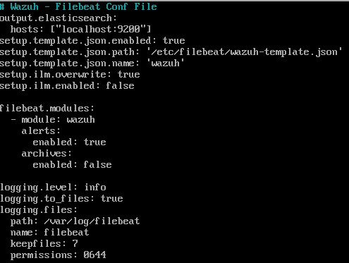

. Download the Wazuh alert template for Elasticsearch and change permissions with the following commands:
+
```
curl -so /etc/filebeat/wazuh-template.json https://raw.githubusercontent.com/wazuh/wazuh/4.1/extensions/elasticsearch/7.x/wazuh-template.json
chmod go+r /etc/filebeat/wazuh-template.json
```

. Test for successful configurations using the command and output in the image below as reference:
+
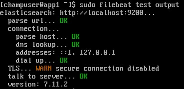

. Install the Wazuh module for Filebeat with the following command:
+
```
curl -s https://packages.wazuh.com/4.x/filebeat/wazuh-filebeat-0.1.tar.gz | tar -xz -C /usr/share/filebeat/module
```

. Start Filebeat with `sudo systemctl daemon-reload`
. Enable Filebeat with `sudo systemctl enable --now filebeat`

=== Kibana
Kibana is a free and open frontend application that sits on top of the Elastic Stack, providing search and data visualization capabilities for data indexed in Elasticsearch. Commonly known as the charting tool for the Elastic Stack, Kibana also acts as the user interface for monitoring, managing, and securing an Elastic Stack cluster.

. Install Kibana with the following command `sudo dnf install kibana-7.11.2 -y`
. Bind Kibana's listening address to the address of the applications server using the following command:
+
```
sudo sed -i -e '/server.host:/s/^#//' -e '/server.host:/s/localhost/192.168.5200.20/' /etc/kibana/kibana.yml
```

. Prepare infrastructure for Wazuh app installation with the following commands:
+
```
sudo mkdir /usr/share/kibana/data
sudo chown -R kibana: /usr/share/kibana/data
sudo chown -R kibana: /usr/share/kibana/plugins
```

. Install the Wazuh plugin for Kibana with the following command:
+
```
sudo -u kibana /usr/share/kibana/bin/kibana-plugin install https://packages.wazuh.com/4.x/ui/kibana/wazuh_kibana-4.1.5_7.11.2-1.zip
```

. Enable Kibana with `sudo systemctl enable --now kibana`
. Restart Elasticsearch and Wazuh Manager with the command `systemctl restart elasticsearch wazuh-manager`
. To verify functionality navigate to `http://app1.college.com:5601` to load the elastic dashboard. It should look similar to the images below:
+
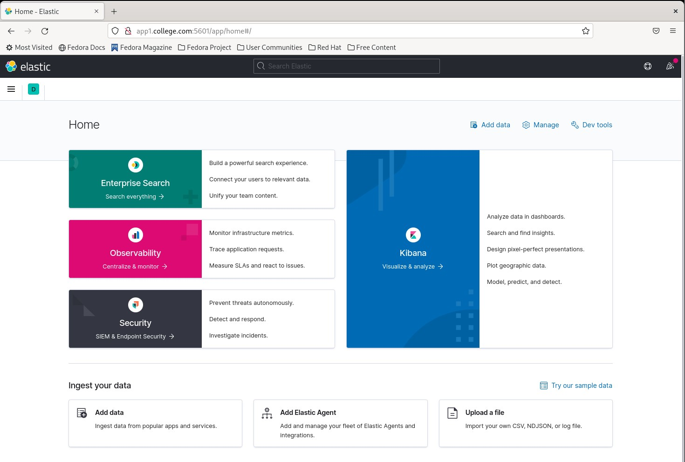
+
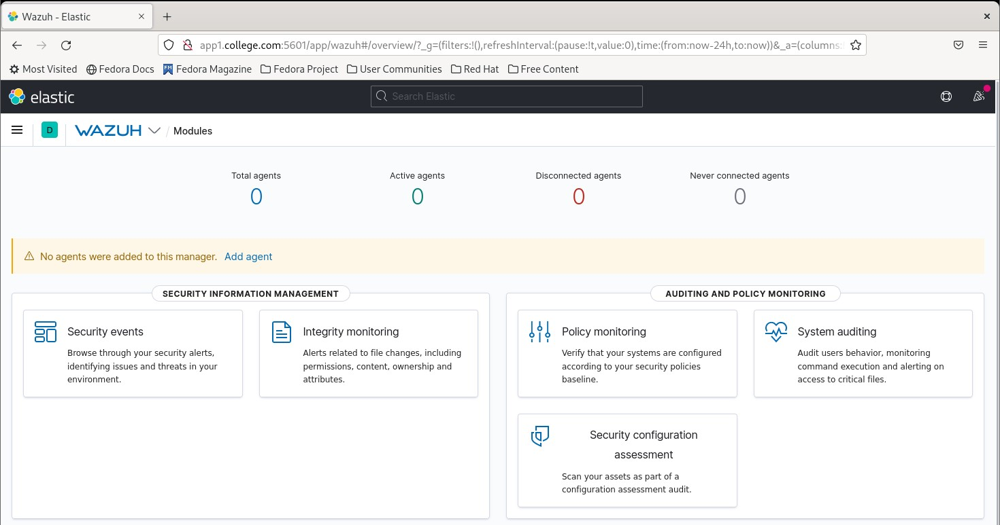

== Agent Installation

. To install Wazuh agents, navigate to every machine you wish to monitor and add the Wazuh repository locally
. Elevate to root with `sudo -i`, and then establish the Wazuh repository with the following command:
+
image::wazuhagentrepo.jpg[Wazuh Agent Repo Conf, align="center"]

. Then import the GPG key using the command `rpm --import https://packages.wazuh.com/key/GPG-KEY-WAZUH`
. Install Wazuh Agent with the following command `sudo dnf install wazuh-agent -y`

. Navigate back to the application server hosting the Wazuh Manager. Run the command `/var/ossec/bin/manage_agents` to start adding agents
.. You should get a prompt like the image below, pressing `Enter` to proceed each time
+
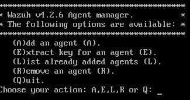

. Select `A` to add agent
. Provide a name for new agent, a safe rule of thumb is their hostnames on the network
. Provide the IP address of the new agent, corresponding to its hostname from the previous question
. Confirm the additon of the new agent
. Extract the key from the agent and save it for later
. Repeat steps 6-10 for each additonal machine you wish to monitor
. Select 'Q' when done to close menu

. On each agent edit the file `/var/ossec/etc/ossec.conf` using Nano or VIM and add the IP of the Wazuh Manager similar to the image below:
.. `sudo nano /var/ossec/etc/ossec.conf`
+
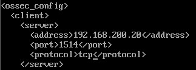

. On each agent, run the command `/var/ossec/bin/manage_agents` to import agent keys generated in earlier step
. Select `I`
. Enter the key you saved earlier in step 10
. Select 'Q' when done to close menu
. Repeat steps 13-15 for each additonal machine you wish to monitor
. Quit and restart the agent to finalize additon of new agent with the command `/var/ossec/bin/wazuh-control restart`

=== Testing Agent Installation

. To test agent connection you can run the command `sudo /var/ossec/bin/agent_control -lc` on the application server with Wazuh Manager
. Alternatively, if you navigate to the Wazuh home page on ElasticSearch, you should see your active agents displayed similar to the image below:
+
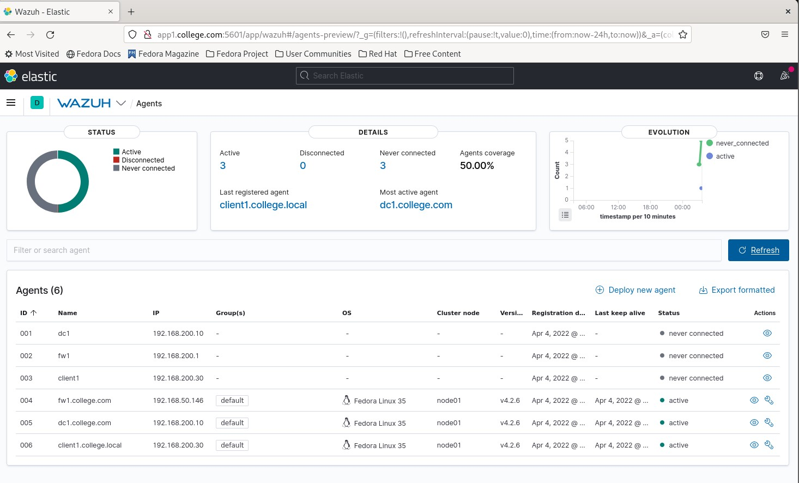

=== Snapshot the Configuration 

Configuration complete! Preserving a functional state of the machine is important in case changes are made accidently. This can be done using VMWare’s snapshot functionality or other software packages for hardware labs.

==  Vulnerability Detection

. Vulnerability detection features can be added to Wazuh by first editing the `/var/ossec/etc/ossec.conf` file and changing the `enabled` state from `no` to `yes` similar to the image below:
.. The ossec.conf file can be edited using the command `sudo nano /var/ossec/etc/ossec.conf`
+
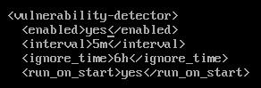

. Then, on each agent you wish to enable vulnerability detection on, navigate to the agent configuration file `/var/ossec/etc/ossec.conf` add the following lines to the configuraton similar to the image below:
.. The agent file can be edited using the command `sudo nano /var/ossec/etc/ossec.conf`
+
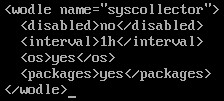

. Restart the Wazuh-Manager on the application server to apply changes with the command `systemctl restart wazuh-manager`

== Demonstrating Active Response

. To demonstrate active response, first edit `/var/ossec/etc/ossec.conf` file and add or verify the following command lines under the `<!-- Active response -->` section so it looks similar to the image below:
+
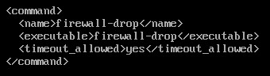

. To implement this active response command, on every agent you wish to enable the rule on, navigate to the agent configuration file `/var/ossec/etc/ossec.conf` add the following lines to the configuraton similar to the image below:
+
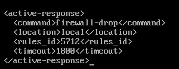

. This is an example of an SSH attack blocking rule not implemented by default on an agent

. Restart the Wazuh-Manager on the application server to apply changes with the command `systemctl restart wazuh-manager`

. To test that this works do the following:
+
Test your ping to the Wazuh Manager or Agent and you should have connectivity `ping WAZUH-MANAGER-IP-ADDRESS` or `ping WAZUH-AGENT-IP-ADDRESS` and you'll get a response as long as you have connectivity.
+
. After testing your initial ping try sshing into either the Wazuh Manager or the Agent without a valid user.
+
Open up `cmd` on your host machine where your vms are stored or use a vm and try to ssh into the Wazuh Manager or Agent.
Use the command `ssh WAZUH-MANAGER-IP-ADDRESS` or `ssh WAZUH-AGENT-IP-ADDRESS` when trying to ssh into either one you need to attempt to login as an invalid user to trigger the specific rule level.
Once you've tried to ssh into the box after around 10-15 tries the ip you're using will end up being blocked by Wazuh. This can be tested by doing a simple ping test before an after.
+
. To see whether your ip ended up being blocked or not simply ping the Wazuh Manager or Agents ip address and it'll be blocked.
+
`ping WAZUH-MANAGER-IP-ADDRESS` or `ping WAZUH-AGENT-IP-ADDRESS`

== File Integrity

. File integrity features should be enabled by default, but you have to show Wazuh where to look on each agent to ensure the feature works effectively
. To enable file integrity, on every agent you wish to enable the rule on, navigate to the agent configuration file `/var/ossec/etc/ossec.conf` add the following lines to the configuraton similar to the image below:
+
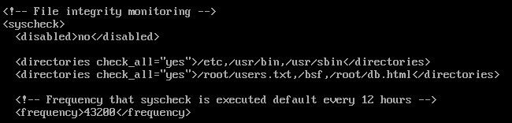

. To adjust the time of scans, you can change the `<frequency>36000</frequency>` tag, or to schedule a scan you can add the `<scan_time>` and `<scan_day>` tags

. Alternatively, if you wish to enable realtime file integrity detection instead of the default configuration, you can with the following commands:
+
```
<syscheck>
  <directories check_all="yes" realtime="yes">c:/tmp</directories>
</syscheck>
```

== Troubleshooting

* To list connected Wazuh agents to see which are working and which are not, issue the command `sudo /var/ossec/bin/agent_control -lc`
* If you find that a change you made is not being implememnted, make sure you restart services after reconfiguring things with `systemctl restart [service]`
* You can find general logs in the `/var/log/...` directories, and systemctl will instruct you on how to determine error codes when you run `systemctl status [service]`

== Contributors
* Ethan Allis
* Liam Barry
