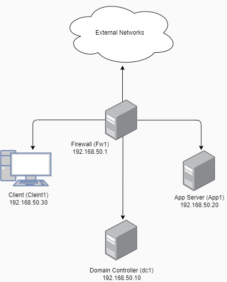
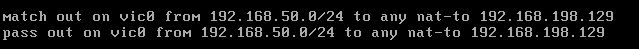

:toc: left
= Test Lab Guide: OpenBSD 7.0

== Abstract 

This Test Lab Guide (TLG) will provide the user with step-by-step instructions on how to configure a basic network configuration using OpenBSD 7.0 servers and an OpenBSD 7.0 client. The resulting test lab environment will provide a stable base for building other test labs. It is recommended that users preserve the start of their test machines once this walk-through has been successfully completed. In a physical environment the hard drive of the machine can be imaged. In a virtual environment, the “snapshot” or equivalent feature can be used to preserve the current state of the operating system. Preserving the working conditions of the basic test lab will allow the user to experiment without fear of having to completely rebuild their environment. The ultimate goal of the TLG is to familiarize the user with the OpenBSD 7.0 Operating system and how to deploy common network services based on that operating system, and ultimately enable the user to conduct their own experiments in an OpenBSD 7.0 based environment.

== Introduction 

The purpose of the Test Lab Guides (TLGs) is providing users with practical guidelines for deploying current operating systems in a way that results in a functional configuration. Using a TLG will instruct the user in which servers to create, how to configure the operating systems and services, and how to install and configure additional software. A TLG experience enables the user to experience the entire set-up process from start to finish.  
 
This TLG is written with the goals of reusability and extensibility in mind. The purpose of this particular TLG is to enable the creation of a basic network utilizing OpenBSD 7.0 as the central operating system. Once this network is complete several other TLGs can be built on top of this base configuration.  
 
Once this lab is completed, it would be wise to save the initial configuration. How this is best done will depend on how the test environment was originally deployed. A physical environment can be preserved by imaging the drives of each machine to be stored in a separate location and retrieved when needed. In a network deployed virtually, a snapshot can be taken of each machine. This will preserve the current settings and configurations. Preserving the lab in a functional state is important, because it allows for a functional configuration to be restored without completely repeating the base lab configuration steps. This is helpful for correcting after a mistake or generating a test environment for a new product.

****
Note: If you are completing these TLG’s in a virtual environment using VMWare and have access to an electronic copy of this document, and you have VMWare Tools installed on the Virtual Machine, utilize the ability to copy and paste text from the host machine to the VM.  Copying and pasting will help to reduce typos and command errors.

* Highlight and right-click a command from this document
* Click Copy
* Right-click in the virtual machine where you would like to copy the text to and click Paste
* If you are working inside a terminal, you may only need to right click in order to copy the command over
****

== Disclaimer

This website contains work created for informational purposes.
Information may be out of date, or changed or updated without notice. By
using this website, you recognize and agree that all information is provided
“AS IS” without warranty of any kind, either express or implied, including,
but not limited to, the implied warranties of merchantability, fitness for a
particular purpose, or non-infringement.

The entire risk arising out of the use of these guides remains with you. IN
NO EVENT SHALL CHAMPLAIN COLLEGE, ITS STUDENTS, FACULTY,
OR ANYONE ELSE INVOLVED IN THE CREATION, PRODUCTION,
OR DELIVERY OF THE GUIDES BE LIABLE TO ANY PERSON FOR
ANY DIRECT, INDIRECT, SPECIAL, OR OTHER CONSEQUENTIAL
DAMAGES FOR ANY USE OF THE MATERIAL ON THIS WEBSITE. This
includes, without limitation, damages for lost profits, business interruption, loss of data or business information, damage to computer equipment or networks, or other loss arising out of the use of any information in the guides.

== Contents of This Guide 

This document contains instructions for setting up the OpenBSD 7.0 base configuration test lab by deploying four OpenBSD servers used as a Client, Firwall, Application, and Domain Controller. Once completed, the lab will simulate the functioning of a private intranet.

*Important*: The instructions provided in this document are for educational purposes. They do not represent best practices nor are they recommendations for a production network. These configurations should not be put into place on a production network. This network should be deployed on a separate network specific to testing (physical or virtual). 

=== Network Overview
The OpenBSD base configuration test lab consists of the following: 

** One server running OpenBSD named fw1
*** IP Address: 192.168.50.1
*** Gateway: N/A
*** DNS Server: 192.168.50.10
*** Hostname: fw1.college.com
*** Two NICs configured to handle traffic between the intranet and the external internet connection 

** One server running OpenBSD named dc1
*** IP Address: 192.168.50.10
*** Gateway: 192.168.50.1
*** DNS Server: 192.168.50.10 (localhost)
*** Hostname: dc1.college.com
*** Configured as the intranet Domain Name System (DNS), and Dynamic Host Configuration Protocol (DHCP) server 

** One server running OpenBSD named app1
*** IP Address: 192.168.50.20
*** Gateway: 192.168.50.1
*** DNS Server: 192.168.50.10
*** Hostname: app1.college.com
*** Configured on the intranet as a system logging server 

** One client running OpenBSD named client1 
*** IP Address: 192.168.50.30
*** Gateway: 192.168.50.1
*** DNS Server: 192.168.50.10
*** Hostname: client1.college.com
*** Will have ability to switch between the intranet and internet subnets 

The OpenBSD 7.0 base configuration TLG is comprised of one subnet: 

** An intranet, known as the internal subnet (192.168.50.0/24 in this example) 

Network Diagram:

This document consists of four major parts as follows: 

** Step One - Configure Firewall

** Step Two - Configure Domain Controller

** Step Three - Configure Client

** Step Four - Configure App Server

=== Hardware and Software Requirements

Minimum requirements:

* Four functioning computers or VMs for configuration with OpenBSD installed.

=== Using “Sudo”

When running many commands throughout these TLGs you may be required to use ‘sudo’ depending on the level of privilege the current user has.  The ‘sudo’ command allows the command following it to be run at superuser privileges.  It is important to note that the user must be in the ‘sudoers’ file in order to successfully use this command. If you make the account an administrator while installing, it will be added to the ‘sudoers’ file automatically. Once a command is preceded by ‘sudo’ the user will be prompted for the password for the account and then the command can be run at superuser privilege.

== Configuring the Environment

=== Install the Operating System on Firewall

. Configure your physical machine or VM to the system specifications you desire
.. At least two cores and two gigabytes of RAM is reccomended for OpenBSD 7 machines
.. Ensure an additional network adapter (NIC) is added to the Firewall machine
. Start the Firewall machine with the .iso or disk installer inserted
.. Use the arrow keys to navigate the installation media, press enter to confirm a selection
.. A mouse can also be used to navigate the GUI installation media
. Upon boot, type in (I) for Install
. Select language relevant to you for the Keyboard Layout or press enter for the default (English)
. Next set your hostname to `fw1`
. After this proceed with the default network interfaces
. Set the root password to: `Ch@mpl@1n!21`
. Create a new user for Firewall
.. In this case the user will be: `champuser`
.. And the password will be: `Ch@mpl@1n!21`
. Set your Timezone to the default one by pressing `Enter` or choose a different one
. Proceed with the Disk Partitioning and continue with the defaults
. Upon completion of the installation, select `R` for Reboot

=== Configure TCP/IP Properties
. Configure hostname on Firewall
.. Elevate to root
... `su` 

.. Get nano text installer
... `pkg_add nano` 
+

.. Change the hostname
... `nano /etc/myname`
... Enter the following: `fw1.college.com`

. Configure the networking on Firewall
.. Enable IP Forwarding
... `sysctl net.inet.ip.forwarding=1`
... `echo 'net.inet.ip.forwarding=1' >> /etc/sysctl.conf`
.. Enable DHCP on vic0
... `echo 'dhcp' > /etc/hostname.vic0`
.. Give internal interface (vic1) a static IP
... `echo 'inet 192.168.50.1 255.255.255.0 192.168.50.255' > /etc/hostname.vic1`
.. Restart Networking
... `sh /etc/netstart`

=== Configuring NAT 
Here we will configure Network Address Translation so that our internal computers can get to the Internet.

. Edit firewall configuration file
.. `nano /etc/pf.conf`
+
****
Note 
The external interface on your OpenBSD vm may be different but mine was vic0
Your external IP may also be different but mine was 192.168.198.129
****
+
.. Add the following line at the bottom of pf.conf:
+
----
match out on vic0 from 192.168.50.0/24 to any nat-to 192.168.198.129
pass out on vic0 from 192.168.50.0/24 to any nat-to 192.168.198.129
----
.. It should look like this:

.. Save changes to the firewall
... `pfctl -f /etc/pf.conf`
.. Restart your firewall
... `reboot`

=== Snapshot the Configuration 

Preserving a functional state of the machine is important in case changes are made accidently. This can be done using VMWare’s snapshot functionality or other software packages for hardware labs. 

=== *Step Two - Configuring the DC*
The below instructions detail the setup of your domain controller (DC).  Here you will configure DC’s hostname and IP address

. Configure hostname on DC
.. Elevate to root
... `su` 
+
****
Note: To save and exit in vi mode type :x
****
.. Change the hostname
... `nano /etc/myname`
... Enter the following: `dc1.college.com`

. Configure networking on DC
.. Set gateway
... `nano /etc/mygate`
... Enter the following: "192.168.50.1"
.. Give your Client an IP address
... `echo 'inet 192.168.50.10 255.255.255.0 192.168.50.255' > /etc/hostname.vic0`
.. Restart Networking
... `sh /etc/netstart`

=== Configuring DHCP
Here you will configure dc as a DHCP server for your network to automatically assign ip addresses.

. Configure DHCP on DC1
.. Enable DHCP to run at boot
... `rcctl enable dhcpd`
.. Set DHCP flags so that DHCP traffic can be sent out
... `rcctl set dhcpd flags vic0`
.. Open the `dhcp.conf` file end enter the information below for the DHCP client’s network settings
... `vi /etc/dhcpd.conf`

----
    subnet 192.168.50.0 netmask 255.255.255.0 {
    	option routers 192.168.50.1;
	    option domain-name-servers 192.168.50.10;
	    range 192.168.50.15 192.168.100.254;
    }
----

=== Configuring DNS 
Here Domain Name Services (DNS) will be configured on DC so that computers inside your network can navigate to outside websites via their hostnames

. Enable unbound to run at boot
.. `rcctl enable unbound`

. Edit the unbound configuration file so that it looks like the following
.. `vi /var/unbound/etc/unbound.conf`
+
----
server: 
        interface: 192.168.50.10
        #interface: 127.0.0.1
        access-control: 192.168.50.0/24 allow
        hide-identity: yes
        hide-version: yes

# DNS for Internal LAN
local-zone: "college.com." static

local-data: "fw1.college.com. IN A 192.168.50.1"
local-data: "dc01.college.com. IN A 192.168.50.10"
local-data: "app1.college.com. IN A 192.168.50.20"

local-data-ptr: "192.168.50.1 fw1.college.com"
local-data-ptr: "192.168.50.10 dc01.college.com"
local-data-ptr: "192.168.50.20 app1.college.com"
----
+
.. After the records add the forward zones in the same file
+
----
forward-zone: 
    name: "."                               #use for ALL queries
    forward-addr: 8.8.8.8@53                #example address only
    forward-addr: 192.168.50.1
    forward-addr: 127.0.0.1@53
    forward-addr: 1.1.1.1@53
    forward-addr: 9.9.9.9@53
----
+

. Restart the unbound service
.. `rcctl restart unbound`

. Edit "/etc/resolv.conf" on dc01
.. Edit "/etc/resolv.conf" on dc01 so it looks similar to this:
... `vi /etc/resolv.conf`
+
----
nameserver 8.8.8.8
nameserver 127.0.0.1
----
+
image::hostnameserver.jpg[Nameserver config, align="center"]
... You should be able to `ping google.com`

=== Snapshot the Configuration 

Preserving a functional state of the machine is important in case changes are made accidently. This can be done using VMWare’s snapshot functionality or other software packages for hardware labs. 

=== *Step Three - Configuring the Client*
The below instructions detail the setup of Client.

. Configure hostname on Client
.. Elevate to root
... `su`
.. Change the hostname
... `vi /etc/myname`
... Enter the following: `client1.college.com`

. Configure networking on Client
.. Set gateway
... `nano /etc/mygate`
... Enter the following: "192.168.50.1"
.. Give your Client an IP address
... `echo 'inet 192.168.50.30 255.255.255.0 192.168.50.255' > /etc/hostname.vic0`
.. Restart Networking
... `sh /etc/netstart`

=== Configuring Client to use DHCP

Here you will configure DHCP on your clients so that they get their IP Addresses automatically assigned.

. Configure DHCP on Client
.. Enable DHCP to run at boot
... `rcctl enable dhcpd`
.. Set DHCP flags so that DHCP traffic can be sent out
... `rcctl set dhcpd flags vic0`
.. Write to the networking file dhcp so client receives an address from dc1
... `echo “dhcp” > /etc/hostname.vic0`
... `sh /etc/restart`
.. You should get a message saying you received an ip address.
.. If you don’t then rebooting your machine might get you an address
... reboot

=== Snapshot the Configuration 

Preserving a functional state of the machine is important in case changes are made accidently. This can be done using VMWare’s snapshot functionality or other software packages for hardware labs. 

=== *Step Four - Configure App1*

The below instructions detail the setup of your application server.

. Configure hostname on App1
.. Elevate to root
... `su` 
.. Change the hostname
... `vi /etc/myname`
... Enter the following: `app1.college.com`

. Configure networking on App1
.. Set gateway
... `nano /etc/mygate`
... Enter the following: "192.168.50.1"
.. Give your Client an IP address
... `echo 'inet 192.168.50.20 255.255.255.0 192.168.50.255' > /etc/hostname.vic0`
.. Restart Networking
... `sh /etc/netstart` 

=== Configuring HTTPD 

Here app1 will be configured to run an apache web server.

. Enable httpd to start at boot
.. `rcctl enable httpd`

. Copy example httpd.conf file to "/etc" directory
.. `cp /etc/examples/httpd.conf /etc`

. Delete SSL configurations from "httpd.conf"
.. `vi /etc/httpd.conf`
.. Navigate to where the configuration for ssl starts, might look something like this:
+
image::ssldeletecursor.jpg[picture of what is going to be deleted for ssl, align="center"]
.. To get rid of all lines below where your cursor is do
... `:+,$d`
. Check if there are any errors in the file
.. `httpd -n`
.. Start the service fi there are no errors
.. `rcctl start httpd`

. Install curl
.. `pkg_add curl`

. Check to see if you get a response from your apache server
.. `curl 192.168.50.20`

. Edit app1’s firewall to allow port 80 traffic then restart the firewall
.. `nano /etc/examples/pf.conf`
.. Add `pass in on egress proto tcp from any to any port 80`
.. `pfctl -f /etc/examples/pf.conf`
. Edit firewall
.. `nano /etc/examples/pf.conf`
.. Add `pass in on egress proto tcp from any to any port 80`
.. `pfctl -f /etc/examples/pf.conf`

. Go back to App1 and allow for http flags
.. `nano /etc/rc.conf.local`
.. `httpd_flags=`
.. `pkg_scripts=httpd`
. Test connection on firewall
.. `pkg_add curl`
.. `curl 192.168.50.20`

=== Snapshot the Configuration 

Preserving a functional state of the machine is important in case changes are made accidently. This can be done using VMWare’s snapshot functionality or other software packages for hardware labs. 

== Troubleshooting

To test network connectivity run `ping 8.8.8.8`. If it fails, run `ping 192.168.50.1` to see if you can ping the router. If you can’t ping the router make sure your computer is on the correct network. If you can but you can’t reach 8.8.8.8, make sure the computer has an ip address and that NAT is working properly. 

If you look up any error codes or messages you are getting, most of the time someone has ran into the same problem and you can find the solution.  

If you run `ping google.com` and it fails but you can `ping 8.8.8.8` then the problem is with your DNS configuration.

If you receive an error that pkg_add didn't work due to ocsp verify failed it's an issue with the system time not setting properly. To fix this do `rdate time.cloudflare.com` to set your time correctly and then use `date` to confirm.