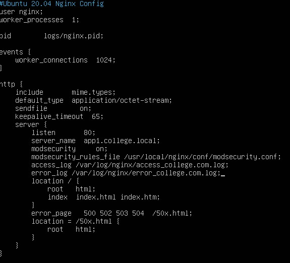
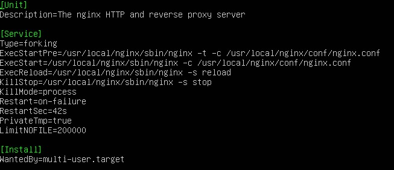
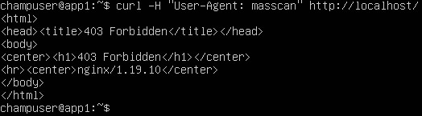
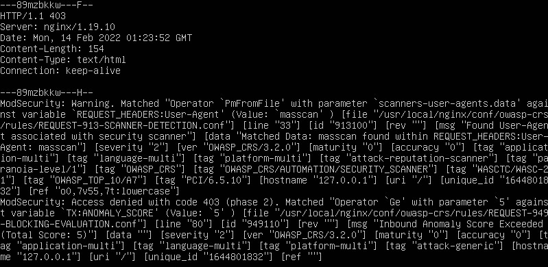

:toc: left
= Test Lab Guide: Ubuntu 20.04 LTS - ModSecurity & Nginx

== Introduction

This document is designed to be used in tandem with the Unix Test Lab Guide (TLG) for Ubuntu 20.04 LTS. It contains instructions on how to install, configure, and test the popular web application security and logging tool: ModSecurity. It will also contain instructions on how to install and configure Nginx, which is highly integrated with ModSecurity. This guide will provide the user a step-by-step guide, upon completion of which will allow them to build thier skills for use in future labs or activities. All configuration steps should be done on the Application Server system unless otherwise noted.

== Installation of ModSecurity

. First, it is recommended that you update your system. You can do this using the command `sudo apt update && sudo apt upgrade -y`
. There are a number of packages and dependencies that are required to install ModSecurity
.. Initial packages can be acquired through the following command:
+
```
sudo apt install git gcc make build-essential autoconf automake libtool libcurl4-openssl-dev liblua5.3-dev libfuzzy-dev ssdeep gettext pkg-config libpcre3 libpcre3-dev libxml2 libxml2-dev libcurl4 libgeoip-dev libyajl-dev doxygen apache2-dev zlib1g-dev openssl -y
```

. Make a modsec directory with the command `mkdir /tmp/modsec`
.. Enter the modsec directory with the command `cd /tmp/modsec`
.. Pull the ModSecurity repo down with `git clone` using the following command:
+
```
git clone --depth 1 -b v3/master --single-branch https://github.com/SpiderLabs/ModSecurity
```

.. Enter the newly created ModSecurity directory with the command `cd ModSecurity/`
.. Install Git submodules with the following commands:
+
```
git submodule init
git submodule update
```
. Run the command `./build.sh` to check for any missing dependencies
.. If there are no missing dependancies, you can configure the ModSecurity build using the command `./configure`
... You can safely ignore the error `fatal: No names found, cannot describe anything`
. Finally, if there are no additional issues, you can compile ModSecurity with the commands `make` and then `sudo make install`

== Installation of Nginx

. Navigate back to the modsec directory with the command `cd /tmp/modsec`
. Download the ModSecurity Nginx connection and Nginx itself with the following commands:
+
```
git clone https://github.com/SpiderLabs/ModSecurity-nginx.git
wget http://nginx.org/download/nginx-1.19.10.tar.gz
```
. Unpack the Nginx tar file with the command `tar xzf nginx-1.19.10.tar.gz`
. Create a non-privilaged user with the command `useradd -r -M -s /sbin/nologin -d /usr/local/nginx nginx`
. Navigate to the unpacked Nginx directory and configure with the new nginx user using the following command:
+
```
./configure --user=nginx --group=nginx --with-pcre-jit --with-debug --with-http_ssl_module --with-http_realip_module --add-module=/tmp/modsec/ModSecurity-nginx
```
. Finally, if there are no additional issues, you can compile nginx with the commands `make` and then `sudo make install`

== Configuring Nginx with ModSecurity

. Copy several files to the Nginx directories and make a backup of the Nginx configuration file using the following commands:
+
```
sudo cp /tmp/modsec/ModSecurity/modsecurity.conf-recommended /usr/local/nginx/conf/modsecurity.conf
sudo cp /tmp/modsec/ModSecurity/unicode.mapping /usr/local/nginx/conf/
sudo cp /usr/local/nginx/conf/nginx.conf{,.bak}
```
. Use nano or vim to edit the nginx.conf file
.. `sudo nano /usr/local/nginx/conf/nginx.conf`
.. Your configurations should look similar to the image below:
+

. Create a new Nginx log directory with the command `sudo mkdir /var/log/nginx`

== Creating the Nginx Service

. Navigate to the system directory and create an `nginx.service` file
.. `sudo nano /etc/systemd/system/nginx.service`
.. Your configurations should look similar to the image below:
+

. Create a symlink with the command `sudo systemctl enable nginx`
.. Reload systemd configurations with `sudo systemctl daemon-reload`
. Finally, if there are no additional issues, start and check the status of Nginx with the following commands:
+
```
sudo systemctl start nginx 
sudo systemctl status nginx
```

== Configuring ModSecurity

. Start by turning on the ModSecurity rule engine with the following command:
+
```
sudo sed -i 's/SecRuleEngine DetectionOnly/SecRuleEngine On/' /usr/local/nginx/conf/modsecurity.conf
```
. It is recommended to change the default log directory for ModSecurity which can be done with the following command:
+
```
sudo sed -i 's#/var/log/modsec_audit.log#/var/log/nginx/modsec_audit.log#' /usr/local/nginx/conf/modsecurity.conf
```
. It is also highly recommended to download the OWASP core ruleset for ModSecurity. Download and rename it using the following commands:
+
```
git clone https://github.com/SpiderLabs/owasp-modsecurity-crs.git /usr/local/nginx/conf/owasp-crs
sudo cp /usr/local/nginx/conf/owasp-crs/crs-setup.conf{.example,}
```
. To instruct ModSecurity to use the new OWASP ruleset use the following command:
+
```
sudo echo -e "Include owasp-crs/crs-setup.conf\nInclude owasp-crs/rules/*.conf" >> /usr/local/nginx/conf/modsecurity.conf
```
. Restart the Nginx service with the command `sudo systemctl restart nginx`

== Testing ModSecurity and Nginx

. To complete a simple test you can issue the command `curl -H "User-Agent: masscan" http://localhost/`
.. This should result in a `403 forbidden` error as shown in the image below:
.. Alternatively, instead of curling to localhost, you could access this from your client1 workstation for the same result
+

. If you configured logging correctly, you should be able to see logs using the command `tail -100 /var/log/nginx/modsec_audit.log`
.. Results should be similar to the image shown below:
+

. This completes the base configuration for ModSecurity and Nginx
.. These configurations can be built upon to include more diverse and in depth rules if desired

== Troubleshooting

* If you are having issues with dependancies while using `./configure` you could try uncommenting `deb-src` URIs in the `/etc/apt/sources.list` file. Follow that command with `sudo apt get update -y` and then `sudo apt-get build-dep nginx`
* If you encounter an error starting your Nginx service, Apache could be blocking it by using its address space. To fix this run the command `sudo apachectl stop`
* If ModSecurity is not blocking your tests, ensure it is enforcing rules by looking for/changing `SecRuleEngine On` in the `/usr/local/nginx/conf/modsecurity.conf` file
* If you find that a change you made is not being implememnted, make sure you restart services after reconfiguring things with `systemctl restart [service]`
* You can find general logs in the `/var/log/...` directories, and systemctl will instruct you on how to determine error codes when you run `systemctl status [service]`

== Contributors
* Ethan Allis
