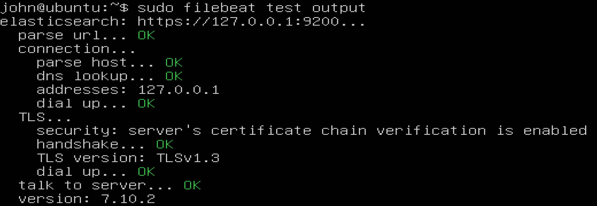
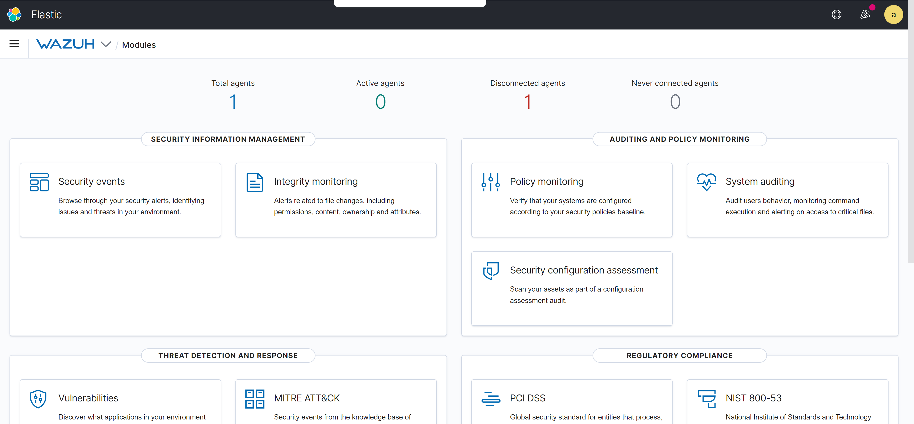
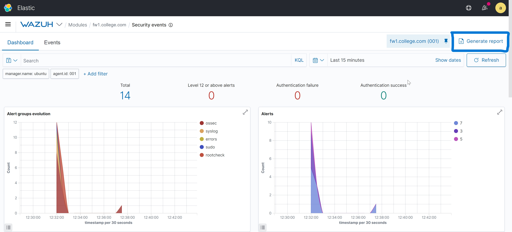
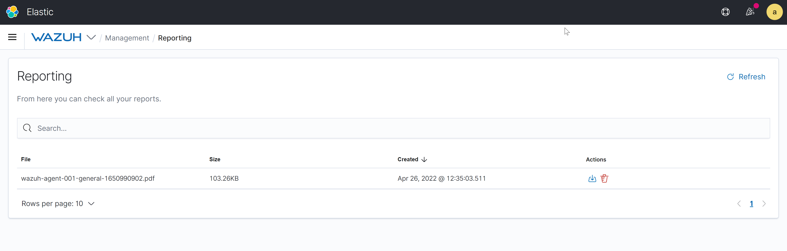
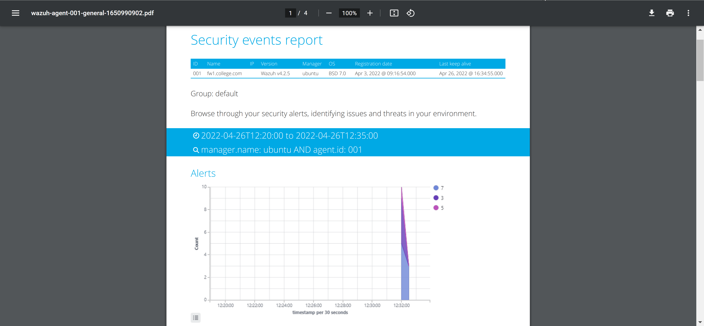
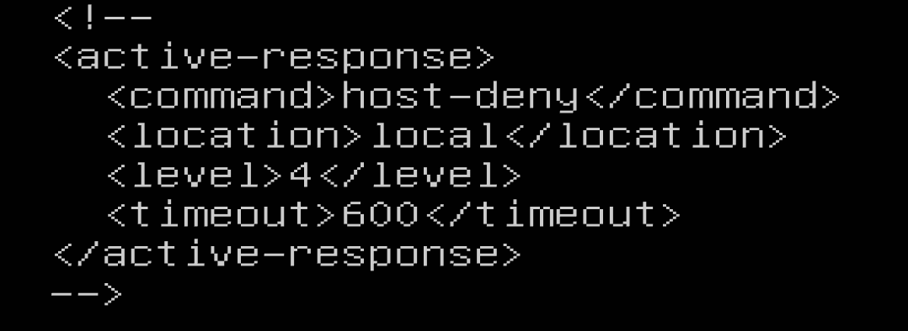
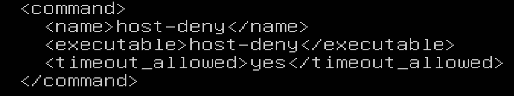

:toc: left
= Test Lab Guide: Ubuntu 20.04 LTS - Wazuh Server

== Introduction

This document is designed to be used in tandem with the Unix Test Lab Guide (TLG) for Ubuntu 20.04 LTS. It contains instructions on how to install, configure, and test the Wazuh Manager. This guide will provide the user a step-by-step guide, upon completion of which will allow them to build their skills for use in future labs or activities. All configuration steps should be done on the Application Server system unless otherwise noted.

== Installation of Wazuh Manager

It is recommended that you update your system. You can do this using the command `sudo apt update && sudo apt upgrade -y`

. First, add the GPG key
+
```
curl -s https://packages.wazuh.com/key/GPG-KEY-WAZUH | sudo apt-key add -
```

. Second, add the Wazuh repository
+
```
echo "deb https://packages.wazuh.com/4.x/apt/ stable main" | sudo tee /etc/apt/sources.list.d/wazuh.list
```

. Install the Wazuh Manager
+
```
sudo apt install wazuh-manager
```

. Start and enable the service
+
```
sudo systemctl daemon-reload
sudo systemctl enable --now wazuh-manager
```

. Check status for the Wazuh Manager and confirm that it's running
```
systemctl status wazuh-manager
```

== Installation of Elasticsearch
Elasticsearch is a distributed, RESTful search and analytics engine capable of addressing a growing number of use cases. As the heart of the Elastic Stack, it centrally stores data for fast search, fine‑tuned relevancy, and powerful analytics that scale with ease. Elasticsearch is commonly used for log analytics, full-text search, security intelligence, business analytics, and operational intelligence use cases.

```
sudo apt install elasticsearch-oss opendistroforelasticsearch
```

. Download the configuration file for `/etc/elasticsearch/elasticsearch.yml`
+
```
sudo curl -so /etc/elasticsearch/elasticsearch.yml https://packages.wazuh.com/resources/4.2/open-distro/elasticsearch/7.x/elasticsearch_all_in_one.yml
```

. Configure the Kibana roles and users the the templates below:
.. This adds the following users to Kibana:
... Wazuh_user - Used for read-only access to the Wazuh Kibana plugin.
... Wazuh_admin - For users who need admin privileges.
.. Two additional roles are also added to gives users appropriate permissions:
... Wazuh_ui_user - provides wazuh_user permissions to read the Wazuh's indicies.
... Wazuh_ui_admin - allows wazuh_admin to perform read/write, management and indexing on wazuh indices.
+
```
sudo curl -so /usr/share/elasticsearch/plugins/opendistro_security/securityconfig/roles.yml https://packages.wazuh.com/resources/4.2/open-distro/elasticsearch/roles/roles.yml

sudo curl -so /usr/share/elasticsearch/plugins/opendistro_security/securityconfig/roles_mapping.yml https://packages.wazuh.com/resources/4.2/open-distro/elasticsearch/roles/roles_mapping.yml

sudo curl -so /usr/share/elasticsearch/plugins/opendistro_security/securityconfig/internal_users.yml https://packages.wazuh.com/resources/4.2/open-distro/elasticsearch/roles/internal_users.yml
```

== Install Certificates

. Remove demo certs
+
```
sudo rm -f /etc/elasticsearch/{esnode-key.pem,esnode.pem,kirk-key.pem,kirk.pem,root-ca.pem}
```

. Download the `wazuh-cert-tool.sh`
+
```
sudo su -
curl -so ~/wazuh-cert-tool.sh https://packages.wazuh.com/resources/4.2/open-distro/tools/certificate-utility/wazuh-cert-tool.sh
curl -so ~/instances.yml https://packages.wazuh.com/resources/4.2/open-distro/tools/certificate-utility/instances_aio.yml
```

. Run the `wazuh-cert-tool.sh`
+
```
bash ~/wazuh-cert-tool.sh
```

. Move the Elasticsearch certificates to the correct location
+
```
mkdir /etc/elasticsearch/certs/
mv ~/certs/elasticsearch* /etc/elasticsearch/certs/
mv ~/certs/admin* /etc/elasticsearch/certs/
cp ~/certs/root-ca* /etc/elasticsearch/certs/
```

. Fix the Log4j2 Vulnerability
+
```
mkdir -p /etc/elasticsearch/jvm.options.d
echo '-Dlog4j2.formatMsgNoLookups=true' > /etc/elasticsearch/jvm.options.d/disabledlog4j.options
chmod 2750 /etc/elasticsearch/jvm.options.d/disabledlog4j.options
chown root:elasticsearch /etc/elasticsearch/jvm.options.d/disabledlog4j.options
```

. Enable and Start Elasticsearch
+
```
systemctl daemon-reload
systemctl enable elasticsearch
systemctl start elasticsearch
systemctl status elasticsearch
```

. Run the Elasticsearch securityadmin script to load new certificates info and to start the cluster
+
```
export JAVA_HOME=/usr/share/elasticsearch/jdk/ && /usr/share/elasticsearch/plugins/opendistro_security/tools/securityadmin.sh -cd /usr/share/elasticsearch/plugins/opendistro_security/securityconfig/ -nhnv -cacert /etc/elasticsearch/certs/root-ca.pem -cert /etc/elasticsearch/certs/admin.pem -key /etc/elasticsearch/certs/admin-key.pem
```

. Confirm the Installation was successful
+
```
curl -XGET https://localhost:9200 -u admin:admin -k
```

== Install Filebeat
Filebeat is a lightweight shipper for forwarding and centralizing log data. Installed as an agent on your servers, Filebeat monitors the log files or locations that you specify, collects log events, and forwards them to Elasticsearch for indexing.

```
sudo apt install filebeat
```

. Download the filebeat config file below used to forward wazuh alerts to elasticsearch
+
```
curl -so /etc/filebeat/filebeat.yml https://packages.wazuh.com/resources/4.2/open-distro/filebeat/7.x/filebeat_all_in_one.yml
```

. Download the alerts template for Elasticsearch
+
```
curl -so /etc/filebeat/wazuh-template.json https://raw.githubusercontent.com/wazuh/wazuh/4.2/extensions/elasticsearch/7.x/wazuh-template.json
chmod go+r /etc/filebeat/wazuh-template.json
```

. Download the Wazuh Filebeat module
+
```
curl -s https://packages.wazuh.com/4.x/filebeat/wazuh-filebeat-0.1.tar.gz | tar -xvz -C /usr/share/filebeat/module
```

. Copy the Elasticsearch certs to `/etc/filebeat/certs`
+
```
mkdir /etc/filebeat/certs
cp ~/certs/root-ca.pem /etc/filebeat/certs/
mv ~/certs/filebeat* /etc/filebeat/certs/
```

. Start and enable Filebeat
+
```
systemctl daemon-reload
systemctl enable --now filebeat
```

. Test that the Filbeat config works
+
```
filebeat test output
```



== Install Kibana
Kibana is an free and open frontend application that sits on top of the Elastic Stack, providing search and data visualization capabilities for data indexed in Elasticsearch. Commonly known as the charting tool for the Elastic Stack, Kibana also acts as the user interface for monitoring, managing, and securing an Elastic Stack cluster.

```
apt install opendistroforelasticsearch-kibana
```

. Download the config file for Kibana
+
```
curl -so /etc/kibana/kibana.yml https://packages.wazuh.com/resources/4.2/open-distro/kibana/7.x/kibana_all_in_one.yml
```

. Create the data directory for Kibana
+
```
mkdir /usr/share/kibana/data
chown -R kibana:kibana /usr/share/kibana/data
```

. Install the Wazuh Kibana plugin
+
```
cd /usr/share/kibana
sudo -u kibana /usr/share/kibana/bin/kibana-plugin install https://packages.wazuh.com/4.x/ui/kibana/wazuh_kibana-4.2.5_7.10.2-1.zip
```

. Copy the Elasticsearch certs to `/etc/kibana/certs`
+
```
mkdir /etc/kibana/certs
cp ~/certs/root-ca.pem /etc/kibana/certs/
mv ~/certs/kibana* /etc/kibana/certs/
chown kibana:kibana /etc/kibana/certs/*
```

. Bind Kibana's socket to port 443
```
setcap 'cap_net_bind_service=+ep' /usr/share/kibana/node/bin/node
```

. Start and enable Kibana
```
systemctl daemon-reload
systemctl enable --now kibana
```

. Allow Kibana on the firewall
```
sudo ufw allow 443/tcp
```

You can now access you wazuh/kibana interface with:
```
URL: https://<wazuh_server_ip>
user: admin
password: admin
```



== Enable Security Vulnerability Scans 

. Edit `/var/ossec/etc/ossec.conf`
+
```
<vulnerability-detector>
  <enabled>yes</enabled>
  <interval>5m</interval>
  <run_on_start>yes</run_on_start>
  <provider name="canonical">
    <enabled>yes</enabled>
    <os>bionic</os>
    <update_interval>1h</update_interval>
  </provider>
  <provider name="nvd">
    <enabled>yes</enabled>
    <update_from_year>2010</update_from_year>
    <update_interval>1h</update_interval>
  </provider>
</vulnerability-detector>
```
This should already be in the config file all you need to do is change `<enabled>no</enabled>` to `<enabled>yes</enabled>`.  
You will also need to reflect this by adding it on to each agent you wanted to run a vulnerability scan on. 

You can generate a report of security events of the agent by going to `Wazuh->Modules->Name of Agent->Security Events`



You can then download this report by going to `Wazuh->Management->Reporting`



An example of a report which was downloaded in a `.pdf` format is shown below:



== Add Active Response Module

. Edit `/var/ossec/etc/ossec.conf` and add the following config:
+


. Check to make sure this has already been added if not add it into the config file:


The `<active-response>` and `</active-response>` should already be in the config file and all you need to do is add the lines in between.
+
. To test that this works do the following:
