:toc: left
= Test Lab Guide: Ubuntu 20.04 LTS

== Abstract 

This Test Lab Guide (TLG) will provide the user with step-by-step instructions on how to configure a basic network configuration using Ubuntu 20.04 LTS servers and an Ubuntu 20.04 LTS client. The resulting test lab environment will provide a stable base for building other test labs. It is recommended that users preserve the start of their test machines once this walk-through has been successfully completed. In a physical environment the hard drive of the machine can be imaged. In a virtual environment, the “snapshot” or equivalent feature can be used to preserve the current state of the operating system. Preserving the working conditions of the basic test lab will allow the user to experiment without fear of having to completely rebuild their environment. The ultimate goal of the TLG is to familiarize the user with the Ubuntu 20.04 LTS Operating system and how to deploy common network services based on that operating system, and ultimately enable the user to conduct their own experiments in an Ubuntu 20.04LTS based environment.

== Introduction 

The purpose of the Test Lab Guides (TLGs) is providing users with practical guidelines for deploying current operating systems in a way that results in a functional configuration. Using a TLG will instruct the user in which servers to create, how to configure the operating systems and services, and how to install and configure additional software. A TLG experience enables the user to experience the entire set-up process from start to finish.  
 
This TLG is written with the goals of reusability and extensibility in mind. The purpose of this particular TLG is to enable the creation of a basic network utilizing Ubuntu 20.04 LTS as the central operating system. Once this network is complete several other TLGs can be built on top of this base configuration.  
 
Once this lab is completed, it would be wise to save the initial configuration. How this is best done will depend on how the test environment was originally deployed. A physical environment can be preserved by imaging the drives of each machine to be stored in a separate location and retrieved when needed. In a network deployed virtually, a snapshot can be taken of each machine. This will preserve the current settings and configurations. Preserving the lab in a functional state is important, because it allows for a functional configuration to be restored without completely repeating the base lab configuration steps. This is helpful for correcting after a mistake or generating a test environment for a new product.

****
Note: If you are completing these TLG’s in a virtual environment using VMWare and have access to an electronic copy of this document, and you have VMWare Tools installed on the Virtual Machine, utilize the ability to copy and paste text from the host machine to the VM.  Copying and pasting will help to reduce typos and command errors.

* Highlight and right-click a command from this document
* Click Copy
* Right-click in the virtual machine where you would like to copy the text to and click Paste
* If you are working inside a terminal, you may only need to right click in order to copy the command over
****

== Disclaimer

This website contains work created for informational purposes.
Information may be out of date, or changed or updated without notice. By
using this website, you recognize and agree that all information is provided
“AS IS” without warranty of any kind, either express or implied, including,
but not limited to, the implied warranties of merchantability, fitness for a
particular purpose, or non-infringement.

The entire risk arising out of the use of these guides remains with you. IN
NO EVENT SHALL CHAMPLAIN COLLEGE, ITS STUDENTS, FACULTY,
OR ANYONE ELSE INVOLVED IN THE CREATION, PRODUCTION,
OR DELIVERY OF THE GUIDES BE LIABLE TO ANY PERSON FOR
ANY DIRECT, INDIRECT, SPECIAL, OR OTHER CONSEQUENTIAL
DAMAGES FOR ANY USE OF THE MATERIAL ON THIS WEBSITE. This
includes, without limitation, damages for lost profits, business interruption, loss of data or business information, damage to computer equipment or networks, or other loss arising out of the use of any information in the guides.

== Contents of This Guide 

This document contains instructions for setting up the Ubuntu 20.04 LTS base configuration test lab by deploying two servers running Ubuntu Server, one client running Ubuntu Desktop and one firewall built on Ubuntu Server. Once completed, the lab will simulate the functioning of a private intranet.  

*Important*: The instructions provided in this document are for educational purposes. They do not represent best practices nor are they recommendations for a production network. These configurations should not be put into place on a production network. This network should be deployed on a separate network specific to testing (physical or virtual). 

=== Network Overview 

The Ubuntu 20.04 LTS Base Configuration test lab consists of the following: 

** One server running Ubuntu Server 20.04 LTS named fw1
*** IP Address: 192.168.100.1
*** Gateway: N/A
*** DNS Server: 192.168.100.10
*** Hostname: fw1.college.com
*** Two NICs configured to handle traffic between the intranet and the external internet connection 

** One server running Ubuntu Server 20.04 LTS named dc1
*** IP Address: 192.168.100.10
*** Gateway: 192.168.100.1
*** DNS Server: 192.168.100.10 (localhost)
*** Hostname: dc1.college.com
*** Configured as the intranet Domain Name System (DNS), and Dynamic Host Configuration Protocol (DHCP) server 

** One server running Ubuntu Server 20.04 LTS named app1
*** IP Address: 192.168.100.20
*** Gateway: 192.168.100.1
*** DNS Server: 192.168.100.10
*** Hostname: app1.college.com
*** Configured on the intranet as a system logging server 

** One client running Ubuntu Desktop 20.04 LTS named client1 
*** IP Address: 192.168.100.30
*** Gateway: 192.168.100.1
*** DNS Server: 192.168.100.10
*** Hostname: client1.college.com
*** Will have ability to switch between the intranet and internet subnets 

The Ubutnu 20.04 LTS Base Configuration TLG is comprised of one subnet: 

** An intranet, known as the internal subnet (192.168.100.0/24 in this example) 

Network Diagram:

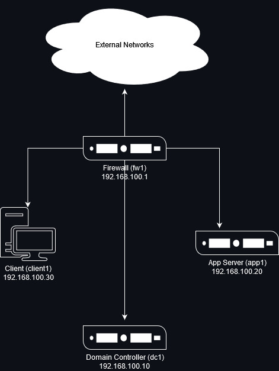

This document consists of four major parts as follows: 

** Step One - Configure Firewall

** Step Two - Configure Domain Controller

** Step Three - Configure Client

** Step Four - Configure App Server

=== Hardware and Software Requirements 

The following are the minimum required components for deploying the test lab:  

** An installer disc or .iso file for Ubutnu Server 20.04.X, 64 bit 

** An installer disc or .iso file for Ubuntu Desktop 20.04.X, 64 bit 

** One machine that will meet the minimum install requirements for Ubuntu Server with 2 NICs 

** Two machines that will meet the minimum install requirements for Ubuntu Server 

** One machine that will meet the minimum install requirements for Ubuntu Desktop 
 
=== Using “Sudo”

When running many commands throughout these TLGs you may be required to use ‘sudo’ depending on the level of privilege the current user has.  The ‘sudo’ command allows the command following it to be run at superuser privileges.  It is important to note that the user must be in the ‘sudoers’ file in order to successfully use this command.  If you make the account an administrator while installing, it will be added to the ‘sudoers’ file automatically.  Once a command is preceded by ‘sudo’ the user will be prompted for the password for the account and then the command can be run at superuser privilege.

== Configuring the Environment
=== **Step One** - Configure Firewall 

The following instructions will detail the installation and configuration of the Firewall system. It will consist of 4 notable sections as follows: 

1.	Installing the Operating System
2.	Configure TCP/IP Properties
3.	Configure NAT Rules
4. Snapshot Configuration

=== Install the Operating System on Firewall

. Configure your physical machine or VM to the system specifications you desire
.. At least two cores and two gigabytes of RAM is reccomended for Ubuntu 20.04 LTS machines
.. Ensure an additional network adapter (NIC) is added to the Firewall machine
. Start the Firewall machine with the .iso or disk installer inserted
.. Use the arrow keys to navigate the installation media, press enter to confirm a selection
. Select language relevant to you and then select `Done`
. Select the keyboard layout relevant to you and then select `Done`
. The server installation media will then prompt you to configure your network interfaces
.. We will configure the network interfaces later, select `Continue without network`
. Select the default values with `Done` for all additional items
. Select `Continue` when prompted regarding overwriting the drive
. Assign Firewall a hostname
.. In this case the hostname will be `fw1`
. Create a new user for Firewall
.. In this case the user will be: `champuser`
.. And the password will be: `Ch@mpl@1n!21`
. Proceed by selecting the default values with `Done` for the remaining items in the installation media
.. Do not install any featured server snaps
. Select `Reboot Now` to complete operating system installation on Firewall

=== Configure TCP/IP Properties

. Make note of the names of your network interfaces
.. Run the command `ls /sys/class/net` to display them
.. The interface name with the lower number attached is usually the WAN interface
. Use nano or vim to edit the local netplan file, yours may have a different name
.. `sudo nano /etc/netplan/00-installer-config.yaml`
. Add the following lines to the netplan file so that it looks similar:
+
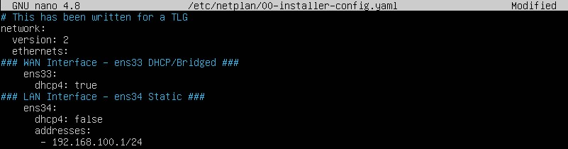
.. If you are not using DHCP assignment for your WAN interface, assign static values similar to the LAN interface
. Save and exit the modified netplan file
.. If using nano press `CTRL + x` and then `y` to save end exit
.. If using vim press `ESC` then type `:wq` to save and exit
. Enter the command `sudo netplan apply` to implement your changes
. Check connectivity of the WAN by entering the command ping google.com -c 4
.. The result should look similar:
+
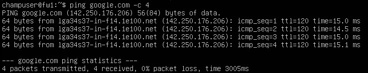
. Use nano or vim to edit the local sysctl.conf file to setup IPv4 forwarding
.. `sudo nano /etc/sysctl.conf`
. Find and uncomment the line `net.ipv4.ip_forward=1`
.. Save and exit the modified sysctl file
. Enter the command `sudo sysctl -p` to implement your changes

=== Configure NAT Rules

. Install iptables-persistent on the local machine
.. `sudo apt install iptables-persistent -y`
.. Select `Yes` during package configuration
.. To list currently applied rules use the command `sudo iptables -L`
. Enable NAT with iptables
.. Elevate to root with `sudo -i`
.. `sudo iptables -t nat -A POSTROUTING -j MASQUERADE`
. Save the iptables configuration so that it will remain after reboot
.. `sudo iptables-save > /etc/iptables/rules.v4`
.. Exit root with `exit`

=== Snapshot the Configuration 

Preserving a functional state of the machine is important in case changes are made accidently. This can be done using VMWare’s snapshot functionality or other software packages for hardware labs.

=== **Step Two** - Configure Domain Controller 

The following instructions will detail the installation and configuration of the client system. It will consist of 6 notable sections as follows: 

1.	Installing the Operating System
2.	Configure TCP/IP Properties
3. Configure DHCP
4. Configure DNS
5. Reconfigure TCP/IP Properties
6. Snapshot Configuration

=== Install the Operating System on Domain Controller

. Configure your physical machine or VM to the system specifications you desire
.. At least two cores and two gigabytes of RAM is reccomended for Ubuntu 20.04 LTS machines
. Start the Domain Controller machine with the .iso or disk installer inserted
.. Use the arrow keys to navigate the installation media, press enter to confirm a selection
. Select language relevant to you and then select `Done`
. Select the keyboard layout relevant to you and then select `Done`
. The server installation media will then prompt you to configure your network interfaces
.. We will configure the network interfaces later, select `Continue without network`
. Select the default values with `Done` for all additional items
. Select `Continue` when prompted regarding overwriting the drive
. Assign Domain Controller a hostname
.. In this case the hostname will be `dc1`
. Create a new user for Domain Controller
.. In this case the user will be: `champuser`
.. And the password will be: `Ch@mpl@1n!21`
. Proceed by selecting the default values with `Done` for the remaining items in the installation media
.. Do not install any featured server snaps
. Select `Reboot Now` to complete operating system installation on Firewall

=== Configure TCP/IP Properties

. Make note of the names of your network interfaces
.. Run the command `ls /sys/class/net` to display them
. Use nano or vim to edit the local netplan file, yours may have a different name
.. `sudo nano /etc/netplan/00-installer-config.yaml`
. Add the following lines to the netplan file so that it looks similar:
+
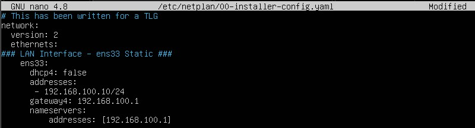
. Save and exit the modified netplan file
. Enter the command `sudo netplan apply` to implement your changes
. Use the command `ping 192.168.100.1 -c 4` to test connectivity

=== Configure DNS

. Install bind9 package
.. `sudo apt install -y bind9`
. Use nano or vim to edit the named.conf.options file
.. `sudo nano /etc/bind/named.conf.options`
. Navigate to the section labled `// forwarders {`
.. Change 0.0.0.0; to your machine's ip address between the curly braces in the forwarder section
.. It should look similar to the following:
+
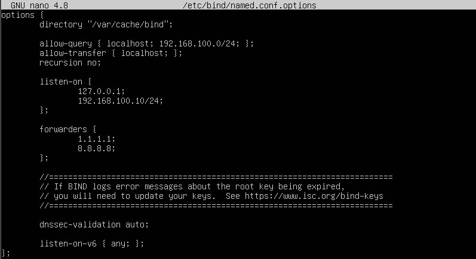
.. Save and exit the modified named.conf.options file
. Use nano or vim to edit the named.local file
.. `sudo nano /etc/bind/named.conf.local`
. Navigate to the bottom of the configuration file
.. Add the following lines at the bottom of the named.conf.local file so that it looks similar:
+
image::namedconflocalmod.jpg[Modified named.conf.local, align="center"]
.. Save and exit the modified named.conf.local file
. Copy the contents of db.local to your new db file
.. `sudo cp /etc/bind/db.local /etc/bind/db.college.com`
. Use nano or vim to edit the new db.college.com file
.. `sudo nano /etc/bind/db.college.com`
. Change and add the following lines to the db.college.com file so that it looks similar:
+
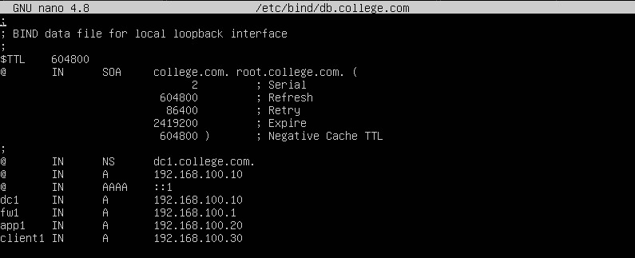
.. Save and exit the modified db.college.com file
. Copy the contents of db.127 to your new db file
.. `sudo cp /etc/bind/db.127 /etc/bind/db.192`
. Use nano or vim to edit the new db.192 file
.. `sudo nano /etc/bind/db.192`
. Change and add the following lines to the db.192 file so that it looks similar:
+
image::db192mod.jpg[Modified db.192, align="center"]
.. Save and exit the modified db.192 file
Use nano or vim to edit the resolv.conf file
.. `sudo nano /etc/resolv.conf`
. Change and add the following lines to the resolv.com file so that it looks similar:
+
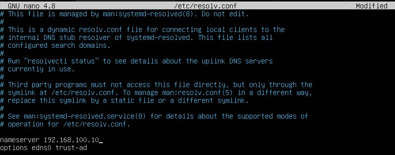
.. Save and exit the modified resolv.conf file
. Restart DNS services
.. `sudo systemctl restart bind9`

=== Configure DHCP

. Install DHCP server package
.. `sudo apt install -y isc-dhcp-server`
. Use nano or vim to edit the isc-dhcp-server file
.. `sudo nano /etc/default/isc-dhcp-server`
. Add relevant network interface within the `INTERFACESv4=""` quotations
.. In this case it should look like `INTERFACESv4="ens33"`
.. Save and exit the modified isc-dhcp-server file
. Use nano or vim to edit the dhcpd.conf file
.. `sudo nano /etc/dhcp/dhcpd.conf`
. Change the following lines to the dhcpd file so that it looks similar:
+
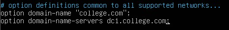
. Navigate down in the file you reach the tag `A slightly different configuration...`
.. Uncomment everything under that description tag down to the white space before the next description tag
. Change the following lines to the dhcpd file so that it looks similar:
+
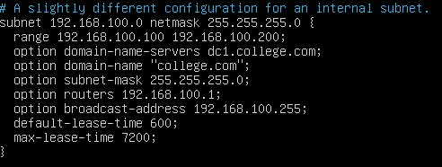
.. Save and exit the modified dhcpd file
. Restart DHCP service
.. `sudo systemctl restart isc-dhcp-server`

=== Reconfigure TCP/IP Properties

. Use nano or vim to edit the local netplan file, yours may have a different name
.. `sudo nano /etc/netplan/00-installer-config.yaml`
. Change the nameservers field so that it matches local address of the Domain Controller
```
nameservers:
    addresses: [192.168.100.10]
```
. Save and exit the modified netplan file
. Enter the command `sudo netplan apply` to implement your changes

=== Snapshot the Configuration 

Preserving a functional state of the machine is important in case changes are made accidently. This can be done using VMWare’s snapshot functionality or other software packages for hardware labs.

=== **Step Three** - Configure Client 

The following instructions will detail the installation and configuration of the client system. It will consist of 3 notable sections as follows: 

1.	Installing the Operating System
2.	Configure TCP/IP Properties
3. Snapshot Configuration

=== Install the Operating System on Client

. Configure your physical machine or VM to the system specifications you desire
.. At least two cores and two gigabytes of RAM is reccomended for Ubuntu 20.04 LTS machines
... More cores and ram may be needed for a GUI system depending on use
. Start the Client machine with the .iso or disk installer inserted
.. Use the mouse and keyboard to navigate the GUI interface on the installation media
. Select the language relevant to you and then select `Install Ubuntu`
. Select the keyboard layout relevant to you and then select `Continue`
. Select Normal or Minimal installation depending on your specific goals
.. To similate an end client we weill use a normal installation
.. Select `Continue`
. Select `Erase disk and install Ubuntu` for the installation type, then select `Install Now`
.. Select `Continue` when prompted regarding overwriting the drive 
. Select time zone relevant to you and then select `Continue`
. Assign Client a hostname
.. In this case the hostname will be `client1`
. Create a new user for Client
.. In this case the user will be: `champuser`
.. And the password will be: `Ch@mpl@1n!21`
. Select `Restart Now` to complete operating system installation on Client

=== Configure TCP/IP Properties

. At this point the DHCP server, dc1, should automatically populate your device with an IP address
. Test connectivity and DNS server function by navigating to Firefox on the left sidebar and browsing to a website
.. Alternatively you can open a terminal window by searching for it in the app list and entering the command `ping google.com -c 4`
. Because we already established static A records for it, client1 will get a static IP too
. To set a static IP on an Ubuntu 20.04 LTS Desktop machine, first navigate to the top right of the GUI window and select the node icon to the left of the sound icon
. Select settings, then select the gear wheel in the Wired section of the new window that has opened. 
. In the Wired window select IPv4.
. Change the IPv4 Method to Mnaual, then input relevant network information in the Addresses and DNS fields respectively. 
. Select Apply to save the configuration.

=== Snapshot the Configuration 

Preserving a functional state of the machine is important in case changes are made accidently. This can be done using VMWare’s snapshot functionality or other software packages for hardware labs.

=== **Step Four** - Configure App Server

The following instructions will detail the installation and configuration of the App Server system. It will consist of 5 notable sections as follows: 

1.	Installing the Operating System
2.	Configure TCP/IP Properties
3. Configure Splunk
4. Configure Splunk Forwarder
5. Snapshot Configuration

=== Install the Operating System on App Server

. Configure your physical machine or VM to the system specifications you desire
.. At least two cores and two gigabytes of RAM is reccomended for Ubuntu 20.04 LTS machines
. Start the App Server machine with the .iso or disk installer inserted
.. Use the arrow keys to navigate the installation media, press enter to confirm a selection
. Select language relevant to you and then select `Done`
. Select the keyboard layout relevant to you and then select `Done`
. The server installation media will then prompt you to configure your network interfaces
.. We will configure the network interfaces later, select `Continue without network`
. Select the default values with `Done` for all additional items
. Select `Continue` when prompted regarding overwriting the drive
. Assign App Server a hostname
.. In this case the hostname will be `app1`
. Create a new user for App Server
.. In this case the user will be: `champuser`
.. And the password will be: `Ch@mpl@1n!21`
. Proceed by selecting the default values with `Done` for the remaining items in the installation media
.. Do not install any featured server snaps
. Select `Reboot Now` to complete operating system installation on App Server

=== Configure TCP/IP Properties

. Make note of the names of your network interfaces
.. Run the command `ls /sys/class/net` to display them
. Use nano or vim to edit the local netplan file, yours may have a different name
.. `sudo nano /etc/netplan/00-installer-config.yaml`
. Add the following lines to the netplan file so that it looks similar:
+
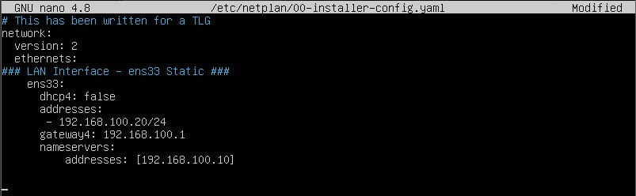
. Save and exit the modified netplan file
. Enter the command `sudo netplan apply` to implement your changes
. Use the command `ping 192.168.100.1 -c 4` to test connectivity

=== Configuring Apache

. Install required packages for Apache functionality with the command `sudo apt install apache2 -y`
. Enable the Apache service on startup with the command `sudo systemctl enable apache2`
. Add the `Apache` profile as an exception in the device firewall using the following command:
+
```
sudo ufw allow 'Apache'
sudo ufw status
```
. Turn the Apache service on with the command `sudo systemctl start apache2`
. Optionally, you can add an `index.html` or any other html document to the `/var/www/html/` directory to customize your webserver
. On client1 using a GUI web brower, you can navigate to the host name of app1 to access the sample webpage as seen in the image below:
.. `http://app1.college.com/`
+
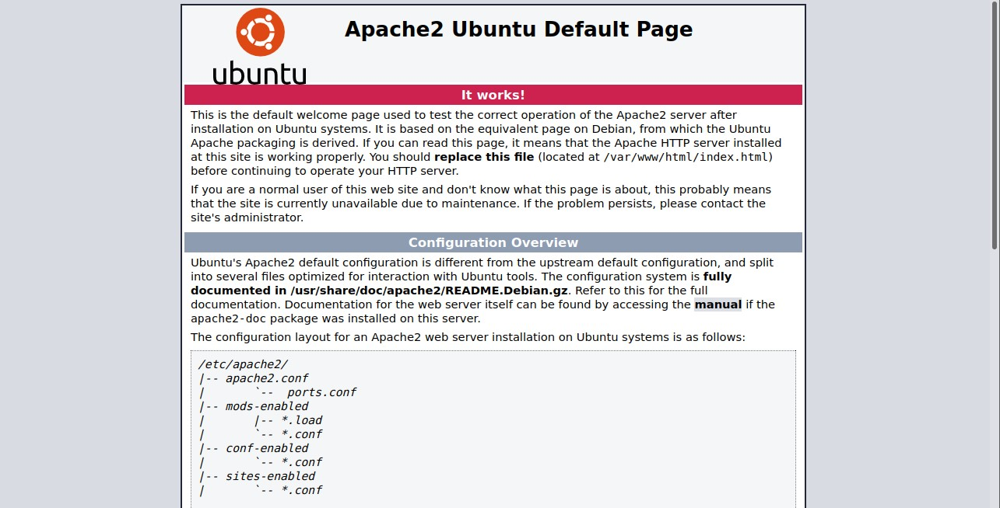
. In the Security Services section of this guide, Mod Security and Nginx are covered and how to implement them on the Application Server

=== Snapshot the Configuration 

Preserving a functional state of the machine is important in case changes are made accidently. This can be done using VMWare’s snapshot functionality or other software packages for hardware labs.

== Security Services

* Placeholder[ModSecurity & Nginx]

== Troubleshooting

* Upon installing an OS, if the machine appears to stall upon final reboot, pressing enter several times will likely bring up a login screen.
* To test firewall functionality client1 could be setup as step two, although the user would be required to setup a static IP within the GUI, as DHCP services would not be configured at that point.
* If you find that a change you made is not being implememnted, make sure you restart services after reconfiguring things with `systemctl restart [service]`
* You can find general logs in the `/var/log/...` directories, and systemctl will instruct you on how to determine error codes when you run `systemctl status [service]`
* Upon receiving connecting issues, always test the service by first pinging the default gateway of your router, and then a public dns service like `8.8.8.8` or `1.1.1.1` if that is successful.

== Contributors
* Ethan Allis
